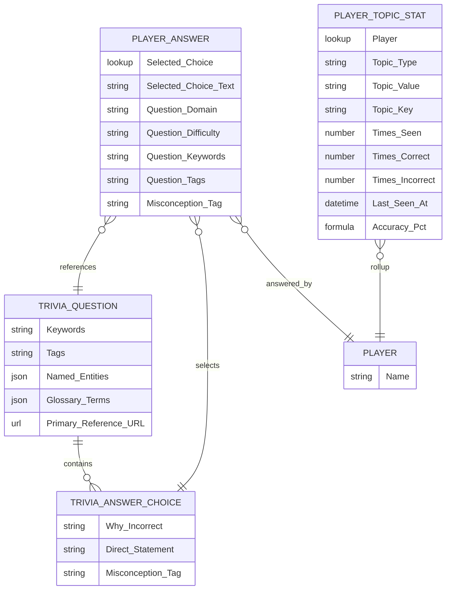

# Question Metadata & Per-User Analytics Enhancements

This release extends the trivia data model so each question, each answer choice,
and each player answer carries enough metadata to power per-user analytics,
guided study sessions, word clouds, and knowledge-graph-style topic maps.

## Why this changed

Two pieces of feedback drove the work:

1. **"Be a caddy for the test taker."** Don't make players tone out at the
   first unrecognized word. Each question can now ship a glossary, a primary
   reference link, keyword/tag/entity hints, and per-choice rationale (why the
   wrong answer is wrong + a direct statement about the correct idea).
2. **"Things specific to questions and answers don't seem to be registering."**
   Player_Answer**c now captures the picked choice as a lookup, the choice
   text, a snapshot of the question's domain/difficulty/keywords/tags, and the
   misconception tag (when the player got it wrong). A new
   `Player_Topic_Stat**c` object rolls these up per user for analytics.

## New fields and objects



### `Trivia_Question__c`

| Field                      | Type             | Purpose                                                                                                               |
| -------------------------- | ---------------- | --------------------------------------------------------------------------------------------------------------------- |
| `Keywords__c`              | Long Text (4000) | Semicolon-separated keywords (`role hierarchy;sharing`) for word clouds & weakness analytics.                         |
| `Tags__c`                  | Text (255)       | Semicolon-separated tags (`data-security;sharing`) — short, controllable taxonomy.                                    |
| `Named_Entities__c`        | Long Text (32k)  | JSON array `[{type,value}]` for knowledge-graph nodes (Feature, Object, Permission, etc.).                            |
| `Glossary_Terms__c`        | Long Text (32k)  | JSON array `[{term,definition}]` — surfaced inline on the result card so players don't bail at unfamiliar vocabulary. |
| `Primary_Reference_URL__c` | URL              | A single, canonical "go read this" link surfaced on the result card.                                                  |

### `Trivia_Answer_Choice__c`

| Field                  | Type             | Purpose                                                                                                              |
| ---------------------- | ---------------- | -------------------------------------------------------------------------------------------------------------------- |
| `Why_Incorrect__c`     | Long Text (4000) | Specific reason this distractor is wrong. Shown on the result card when the player picked it.                        |
| `Direct_Statement__c`  | Long Text (4000) | Plain assertion about this choice (true for correct, false-but-instructive for wrong).                               |
| `Misconception_Tag__c` | Text (120)       | Short slug identifying the misconception, e.g. `confuses-owd-with-hierarchy`. Rolled up into `Player_Topic_Stat__c`. |

### `Player_Answer__c`

| Field                     | Type                               | Purpose                                                                             |
| ------------------------- | ---------------------------------- | ----------------------------------------------------------------------------------- |
| `Selected_Choice__c`      | Lookup → `Trivia_Answer_Choice__c` | The exact choice the player picked. Enables per-distractor analytics.               |
| `Selected_Choice_Text__c` | Text (255)                         | Snapshot text — survives question edits/retirement.                                 |
| `Question_Domain__c`      | Text (255)                         | Snapshot of `Exam_Domain__r.Name`.                                                  |
| `Question_Difficulty__c`  | Text (40)                          | Snapshot of question difficulty.                                                    |
| `Question_Keywords__c`    | Long Text (4000)                   | Snapshot of keywords (denormalized so historic analytics survive question changes). |
| `Question_Tags__c`        | Text (255)                         | Snapshot of tags.                                                                   |
| `Misconception_Tag__c`    | Text (120)                         | Copied from the picked choice when incorrect.                                       |

### New object `Player_Topic_Stat__c`

Rolls up everything a player has ever seen by topic.

| Field                                                       | Type                                     | Notes                                                                |
| ----------------------------------------------------------- | ---------------------------------------- | -------------------------------------------------------------------- | ---- | ---------------------------------- |
| `Player__c`                                                 | Lookup → `Player__c` (required, cascade) | The player.                                                          |
| `Topic_Type__c`                                             | Picklist                                 | `Keyword`, `Tag`, `Entity`, `Domain`, `Difficulty`, `Misconception`. |
| `Topic_Value__c`                                            | Text (255)                               | The actual term (e.g. `Role Hierarchy`).                             |
| `Topic_Key__c`                                              | Text (200), External ID, Unique          | Composite key `PlayerId                                              | Type | lower(value)`. Idempotent upserts. |
| `Times_Seen__c` / `Times_Correct__c` / `Times_Incorrect__c` | Number                                   | Running counters.                                                    |
| `Last_Seen_At__c`                                           | DateTime                                 | For decay/relevance ranking.                                         |
| `Accuracy_Pct__c`                                           | Formula                                  | `IF(Times_Seen__c = 0, 0, Times_Correct__c / Times_Seen__c * 100)`.  |

## New Apex

- `CertGamePlayerInsightsService` — `without sharing`, runs in
  `AccessLevel.SYSTEM_MODE`.
    - `recordAnswerInsights(playerId, question, picked, isCorrect)` — invoked
      from `CertGameSessionService.recordAnswerFromSlack` after the
      `Player_Answer__c` upsert. Idempotent via `Topic_Key__c` external id.
    - `weakestTopics(playerId, minSeen, limitN)` — lowest-accuracy topics with
      enough samples; powers coaching lines + study-plan ranking.
    - `wordCloud(playerId, topicType, limitN)` — frequency-ranked topics of a
      type for word-cloud rendering.

## Changes to existing flow

- `CertGameImportService.importPack(json)` now persists the new question and
  choice metadata when present (all fields are optional — old packs still
  import). New helpers: `joinList`, `serializeIfList`, `clip`.
- `CertGameSessionService.recordAnswerFromSlack` now pre-fetches the question
  with the new fields, snapshots them onto `Player_Answer__c`, and calls
  `CertGamePlayerInsightsService` after the upsert. Insight failures are
  logged but never block scoring.
- The Slack result card explanation is enriched in-line with `Why incorrect`,
  `Key idea`, glossary terms, and the primary reference link — no Block Kit
  layout changes were required.

## Sample data

- `sample_data/adm201-question-pack.enhanced.sample.json` — a single
  representative question that exercises every new key (`keywords`, `tags`,
  `namedEntities`, `glossaryTerms`, `primaryReferenceUrl`, per-choice
  `whyIncorrect`, `directStatement`, `misconceptionTag`). The existing packs
  still import unchanged.

## SOQL examples

```sql
-- Weakest topics for a given player (3+ samples)
SELECT Topic_Type__c, Topic_Value__c, Times_Seen__c, Accuracy_Pct__c
FROM Player_Topic_Stat__c
WHERE Player__c = :playerId AND Times_Seen__c >= 3
ORDER BY Accuracy_Pct__c ASC
LIMIT 10

-- Most-seen keywords (word cloud)
SELECT Topic_Value__c, Times_Seen__c, Accuracy_Pct__c
FROM Player_Topic_Stat__c
WHERE Player__c = :playerId AND Topic_Type__c = 'Keyword'
ORDER BY Times_Seen__c DESC LIMIT 50

-- Recurring misconceptions
SELECT Topic_Value__c, Times_Incorrect__c
FROM Player_Topic_Stat__c
WHERE Player__c = :playerId AND Topic_Type__c = 'Misconception'
ORDER BY Times_Incorrect__c DESC LIMIT 10
```

## Permission set

`Cert_Game_Admin` was extended with object permissions for
`Player_Topic_Stat__c` and field-level permissions for every new field.
`Accuracy_Pct__c` is read-only (formula).

## What's deliberately not in scope here

- A Slack word-cloud renderer or knowledge-graph view. Data is now collected;
  rendering is a follow-up phase.
- A dedicated LWC for "my weak spots." The SOQL above is enough to prototype;
  formal UI lives behind Phase 5/9 work.
- Backfilling historic `Player_Answer__c` rows. New rows from the moment of
  deploy onward will be enriched.

See [docs/\_site Analytics section](docs_site/analytics/per-user-insights.md)
for the player-facing narrative and study-session blueprint.
