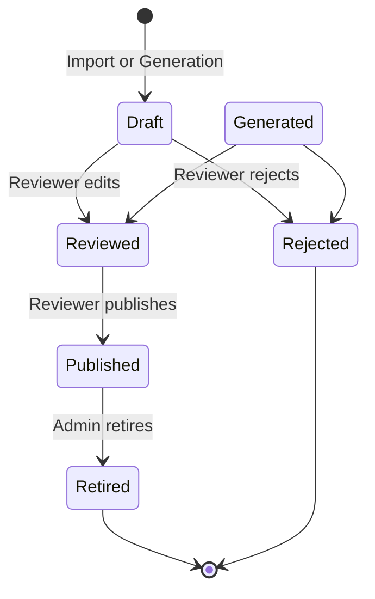
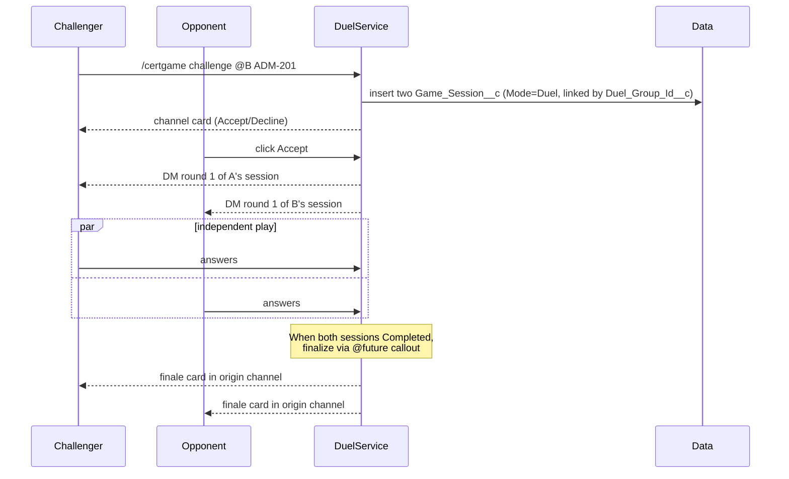
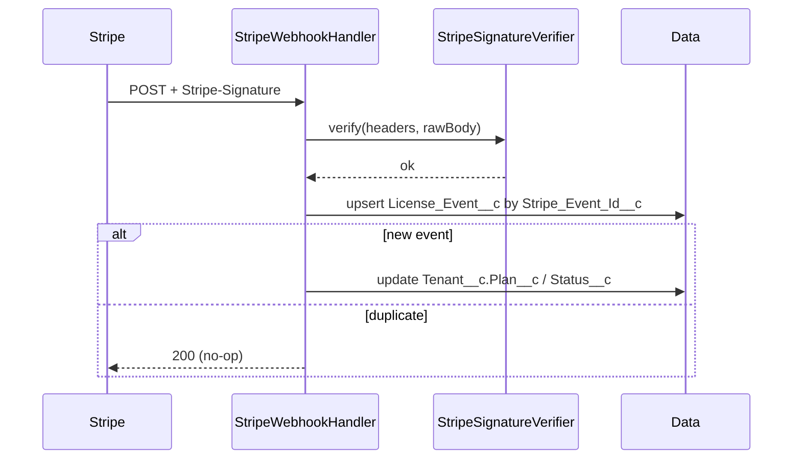
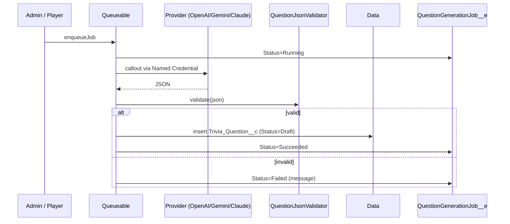
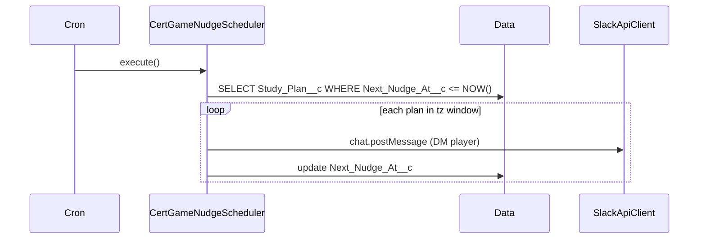

# Data Flow

## Question lifecycle

Only `Published` questions are selected by
[`CertGameSessionService.openNextRound`](../api-reference/apex.md#certgamesessionservice).

## Solo game

```mermaid
sequenceDiagram
    participant U as User
    participant H as CommandHandler
    participant G as EntitlementGuard
    participant T as TenantService
    participant S as SessionService
    participant SC as ScoringService
    participant D as Data

    U->>H: /certgame play ADM-201
    H->>T: getOrCreateTenant(team_id)
    T->>D: upsert Tenant__c
    H->>G: canStartGame(tenantId)
    G->>D: read Usage_Metric__c
    G-->>H: true
    H->>T: getOrCreatePlayer(tenantId, user_id)
    T->>D: upsert Player__c
    H->>S: startQuickGameFromSlack(...)
    S->>D: insert Game_Session__c, Game_Round__c
    S-->>H: round card JSON

    loop until last round
        U->>H: tap answer button
        H->>S: recordAnswerFromSlack(round, choice)
        S->>SC: score(input)
        SC-->>S: points
        S->>D: insert Player_Answer__c (unique key)
        S->>D: update Player__c rollups
        S-->>H: explanation + next round card
    end

    S-->>H: finale card
```

## Duel

## Stripe webhook

## Question generation

The `QuestionGenerationJob__e` Platform Event drives the `generationJobConsole` LWC over
CometD.

## Nudge dispatcher

