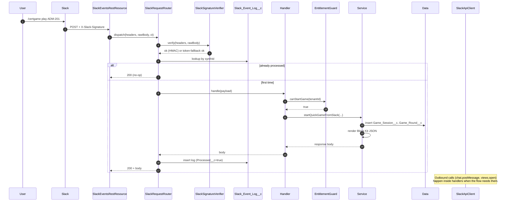

# Architecture Overview

## Layering

```mermaid
flowchart TB
    subgraph External
      U[Slack user]
      ST[Stripe]
      LLM[OpenAI / Gemini / Claude]
    end

    subgraph Salesforce Site (Guest User)
      EP1[/services/apexrest/slack/events]
      EP2[/services/apexrest/stripe/webhook]
    end

    subgraph Apex - Verification
      SV[SlackSignatureVerifier]
      STV[StripeSignatureVerifier]
    end

    subgraph Apex - Routing
      RT[SlackRequestRouter]
    end

    subgraph Apex - Handlers
      H1[SlackCertGameCommandHandler]
      H2[SlackCertGameInteractionHandler]
      H3[SlackCertGameModalHandler]
      H4[SlackCertGameEventHandler]
    end

    subgraph Apex - Services
      G[EntitlementGuard]
      S1[CertGameSessionService]
      S2[CertGameScoringService]
      S3[CertGameTenantService]
      S4[CertGameLeaderboardService]
      S5[CertGameStudyPlanService]
      S6[CertGameTournamentService]
      S7[CertGameAchievementService]
      S8[CertGameDuelService]
      S9[CertGameImportService]
      S10[CertGameAppHomeService]
      S11[CertGameBillingService]
      S12[CertGameSlackRenderService]
      AC[SlackApiClient]
    end

    subgraph Apex - Async
      Q1[CertGameGenerationJobQueueable]
      Q2[CertGameNudgeScheduler]
    end

    subgraph Data
      D[(27 Custom Objects)]
      MD[App_Setting__mdt]
      PE[QuestionGenerationJob__e]
    end

    subgraph LWC
      L1[questionReviewConsole]
      L2[questionBankManager]
      L3[generationJobConsole]
      L4[tournamentBuilder]
      L5[certGameAdminHome / Dashboard / etc.]
    end

    U --> EP1 --> SV --> RT --> H1 & H2 & H3 & H4
    H1 & H2 & H3 & H4 --> G --> S1 & S4 & S5 & S6 & S7 & S8
    S1 --> S2
    S1 & S4 & S5 & S6 & S7 & S8 & S10 --> S12 --> AC
    AC -.->|chat.postMessage / views.open| External
    ST --> EP2 --> STV --> S11 --> D

    L1 & L2 & L3 & L4 & L5 --> S9 & S6 & S4
    Q1 -- generate --> LLM
    Q1 --> PE
    PE --> L3
    Q2 --> AC
    G --> MD
    S1 & S3 & S4 & S5 & S6 & S7 & S8 & S9 & S11 --> D
```

## Layer responsibilities

| Layer            | Responsibility                          | Rule                                                           |
| ---------------- | --------------------------------------- | -------------------------------------------------------------- |
| **Ingress**      | Receive HTTP from Slack/Stripe.         | `without sharing` only here; verify signature immediately.     |
| **Verification** | HMAC + timestamp window.                | No DML. `@TestVisible` secret override.                        |
| **Routing**      | Idempotency + payload-type dispatch.    | One `Slack_Event_Log__c` per inbound event.                    |
| **Handlers**     | Translate Slack payload → service call. | No SOQL in loops, no inline Block Kit.                         |
| **Services**     | Business logic. Bulk-first APIs.        | `with sharing` unless explicit reason.                         |
| **Render**       | Build Block Kit JSON.                   | All JSON lives in `CertGameSlackRenderService`.                |
| **Guards**       | Plan/quota checks.                      | `EntitlementGuard` is the single answer to "can this happen?". |
| **Data**         | 27 custom objects.                      | Idempotency keys on every external boundary.                   |
| **Async**        | Generation, nudges, citation auditing.  | Queueable / Schedulable, never blocks the Slack ack.           |

## Design rules (from AGENTS.md)

- Salesforce is the source of truth.
- Drafts never play live.
- No secrets in code — Named Credentials + External Credentials only.
- `with sharing` + CRUD/FLS on every user-touching Apex class.
- Idempotency everywhere external (Slack retries, Stripe webhooks, LLM callbacks).
- Bulkify; service methods accept `List<>` first.
- Custom Metadata, not constants. Quotas/feature flags live in `App_Setting__mdt`.
- ≥85% test coverage overall, ≥95% on security-critical classes.

## Request lifecycle (slash command)



## Where to look in code

| Concern      | Class                                                                         |
| ------------ | ----------------------------------------------------------------------------- |
| HTTP entry   | `SlackEventsRestResource`, `StripeWebhookHandler`                             |
| Verification | `SlackSignatureVerifier`, `StripeSignatureVerifier`                           |
| Routing      | `SlackRequestRouter`                                                          |
| Game loop    | `CertGameSessionService`, `CertGameScoringService`                            |
| Tenancy      | `CertGameTenantService`, `Tenant__c`                                          |
| Entitlements | `EntitlementGuard`, `Usage_Metric__c`, `App_Setting__mdt`                     |
| Billing      | `CertGameBillingService`, `StripeWebhookHandler`, `License_Event__c`          |
| Rendering    | `CertGameSlackRenderService`, `CertGameStrings`                               |
| Outbound     | `SlackApiClient`                                                              |
| Async        | `CertGameGenerationJobQueueable`, `CertGameNudgeScheduler`                    |
| Import       | `CertGameImportService`, `QuestionJsonValidator`, `QuestionDuplicateDetector` |
