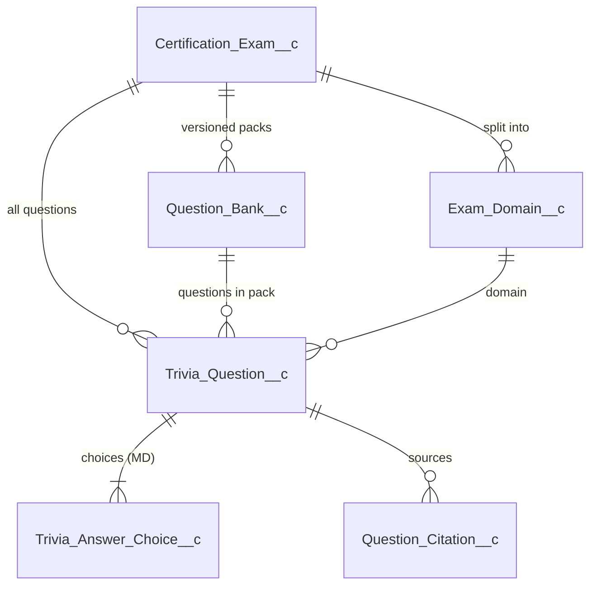

# :material-book-open-page-variant-outline: Content & Curation

The "what we ask players" tree: exams → domains → packs → questions → choices + citations. This is also the **primary output of the LLM generator** — every field below is something a generator can populate, and a richer JSON means richer analytics downstream.

!!! tip "Reviewer's golden path"
    `Draft → NeedsReview → Published`. The only thing that should set `Published` is the `questionReviewConsole` LWC — see [Lifecycles](lifecycles.md).

---

## :material-school-outline: Certification_Exam__c

**Purpose.** The catalog entry for one certification (ADM-201, PD-1, etc.). The root of the content tree.

**External ID.** `Certification_Code__c` — drives `/certgame play <CODE>` and import upserts.

| Field | Type | Set by | Purpose |
|-------|------|--------|---------|
| `Certification_Code__c` | Text(80) ext-id | :material-pencil-outline: editable | The exam code (`ADM-201`). |
| `Vendor__c` | Text(255) | :material-pencil-outline: editable | `Salesforce`, `AWS`, etc. |
| `Track__c` | Text(120) | :material-pencil-outline: editable | High-level grouping (Admin / Developer / Architect). |
| `Level__c` | Text(60) | :material-pencil-outline: editable | `Associate`, `Professional`, etc. |
| `Difficulty__c` | Picklist | :material-pencil-outline: editable | `Beginner` / `Intermediate` / `Advanced` / `Expert`. |
| `Role_Family__c` | Text(255) | :material-pencil-outline: editable | Persona target ("Admin", "Architect"). Used in catalog filters. |
| `Description__c` | LongText | :material-pencil-outline: editable | Marketing-style blurb. |
| `Notes__c` | LongText | :material-pencil-outline: editable | Internal curator notes (not surfaced to players). |
| `Official_Exam_Guide_URL__c` | URL | :material-pencil-outline: editable | Vendor exam guide link. Surfaced in study guide. |
| `Cost__c` | Currency | :material-pencil-outline: editable | Sticker price. |
| `Passing_Score_Percent__c` | Percent | :material-pencil-outline: editable | Used in readiness reports as the target line. |
| `Default_Timer_Seconds__c` | Number | :material-pencil-outline: editable | Per-question timer when a session doesn't override. |
| `Icon_Emoji__c` | Text(10) | :material-pencil-outline: editable | Slack Block Kit icon. |
| `Active__c` | Checkbox | :material-pencil-outline: editable | Hides retired exams from `/certgame play` autocomplete. |
| `Premium_Only__c` | Checkbox | :material-pencil-outline: editable | Gated to Pro/Enterprise tenants. |

---

## :material-table-of-contents: Exam_Domain__c

**Purpose.** Skill-domain breakdown within an exam. Drives per-domain accuracy stats and study recommendations.

| Field | Type | Set by | Purpose |
|-------|------|--------|---------|
| `Name` | Standard | :material-pencil-outline: editable | The domain title — **this is what `Trivia_Question__c.Exam_Domain__r.Name` matches against generator JSON.** |
| `Certification_Exam__c` | Lookup | :material-pencil-outline: editable | Owning exam. |
| `Domain_Order__c` | Number | :material-pencil-outline: editable | Display order in reports. |
| `Weight_Percent__c` | Percent | :material-pencil-outline: editable | Official blueprint weight. Used in readiness weighting. |
| `Official_Objective_Text__c` | LongText | :material-pencil-outline: editable | Verbatim blueprint copy — useful as LLM-prompt input. |

!!! info "Why this matters for generation"
    The generator is told the **list of valid domain names** for an exam; the importer matches the `domain` string in the JSON to an `Exam_Domain__c.Name` (case-sensitive). Mismatched strings leave the lookup null and log a warning.

---

## :material-folder-multiple-outline: Question_Bank__c

**Purpose.** A versioned grouping of questions for an exam. The output of one import or one generation run.

**External ID.** `External_Id__c` — e.g. `BANK-ADM201-202605240730`.

| Field | Type | Set by | Purpose |
|-------|------|--------|---------|
| `External_Id__c` | Text(80) ext-id | :material-cog-sync-outline: system | Upsert key. |
| `Name` | Standard | :material-pencil-outline: editable | Human-readable label. |
| `Certification_Exam__c` | Lookup | :material-pencil-outline: editable | Owning exam. |
| `Tenant__c` | Lookup | :material-cog-sync-outline: system | Owning tenant (for tenant-private packs). |
| `Version__c` | Text(20) | :material-pencil-outline: editable | `1.0.0`, `2.0.0`. |
| `Premium__c` | Checkbox | :material-pencil-outline: editable | Pro-only pack. |
| `Status__c` | Picklist | :material-pencil-outline: editable | `Draft` / `Review` / `Published` / `Retired`. |
| `Source_Type__c` | Picklist | :material-pencil-outline: editable | `Manual` / `Generated` / `Imported` / `Curated`. |
| `Generated_By_Model__c` | Text(80) | :material-cog-sync-outline: system | Model id when source is `Generated` (e.g. `gpt-4.1-mini`). |
| `Prompt_Version__c` | Text(40) | :material-cog-sync-outline: system | Generator prompt version label. Lets you A/B prompts. |
| `Created_From_File__c` | Text(255) | :material-cog-sync-outline: system | Source filename when imported. |

---

## :material-comment-question-outline: Trivia_Question__c

**Purpose.** The question record itself. **Drafts never play live** — `CertGameSessionService` queries `Status__c = 'Published'` only.

**External ID.** `External_Id__c` — `<examCode-lower>-<topic-slug>-<NN>`.

| Field | Type | Set by | Purpose |
|-------|------|--------|---------|
| `External_Id__c` | Text(80) ext-id | :material-cog-sync-outline: system | Stable cross-pack id. Upsert key. |
| `Certification_Exam__c` | Lookup | :material-pencil-outline: editable | Owning exam. |
| `Question_Bank__c` | Lookup | :material-pencil-outline: editable | Owning pack. |
| `Exam_Domain__c` | Lookup | :material-pencil-outline: editable | Resolved from JSON `domain` string. |
| `Question_Text__c` | LongText | :material-pencil-outline: editable | The prompt body. |
| `Scenario_Text__c` | LongText | :material-pencil-outline: editable | Optional set-up paragraph rendered above the question. |
| `Question_Type__c` | Picklist | :material-pencil-outline: editable | `Single Select` / `Multi Select` / `True False`. |
| `Correct_Answer_Mode__c` | Picklist | :material-pencil-outline: editable | `Exact` / `AnyOf` / `MultiRequired`. Derived from `Question_Type__c` at import. |
| `Difficulty__c` | Picklist | :material-pencil-outline: editable | `Beginner` / `Intermediate` / `Advanced` / `Expert`. |
| `Status__c` | Picklist | :material-cog-sync-outline: system (publish-gated) | `Draft` / `Needs Review` / `Needs Revision` / `Published` / `Retired` / `Rejected`. **Only LWC may set Published.** |
| `Explanation__c` | LongText | :material-pencil-outline: editable | One-paragraph rationale shown after answer. |
| `Keywords__c` | LongText(4000) | :material-pencil-outline: editable | Comma-joined. Drives `Player_Topic_Stat__c` keyword rollups and word clouds. |
| `Tags__c` | Text(255) | :material-pencil-outline: editable | Short controllable taxonomy. Broader badges than keywords. |
| `Named_Entities__c` | LongText (JSON) | :material-pencil-outline: editable | JSON array of entity strings — knowledge-graph nodes. |
| `Glossary_Terms__c` | LongText (JSON) | :material-pencil-outline: editable | JSON array of `{term, definition}` — surfaced inline on the result card. |
| `Primary_Reference_URL__c` | URL | :material-pencil-outline: editable | Single canonical "go read this" link. |
| `Hash__c` | Text(128) | :material-cog-sync-outline: system | SHA-256 of normalized stem + sorted correct-choice text. Set by `QuestionDuplicateDetector.hash`. |
| `Fact_Check_Passed__c` | Checkbox | :material-cog-sync-outline: system | Publish gate. |
| `Fact_Checked_By__c` | Lookup → User | :material-cog-sync-outline: system | Reviewer. |
| `Fact_Checked_Date__c` | DateTime | :material-cog-sync-outline: system | When. |
| `Published_By__c` | Lookup → User | :material-cog-sync-outline: system | Who clicked Publish. |
| `Published_Date__c` | DateTime | :material-cog-sync-outline: system | When. |
| `Last_Verified_Date__c` | Date | :material-cog-sync-outline: system | Latest citation re-verification. |
| `Reviewer_Notes__c` | LongText | :material-pencil-outline: editable | Free-text review feedback. |

!!! abstract "Metadata pays compound interest"
    Every populated `Keywords__c`, `Tags__c`, `Named_Entities__c`, and `Glossary_Terms__c` value flows into `Player_Topic_Stat__c` on answer. Sparse metadata → blank weakness reports. **See [Generation Prompts](../generation/prompts.md) for the template that maximises yield.**

---

## :material-format-list-checks: Trivia_Answer_Choice__c

**Purpose.** Master-detail child of `Trivia_Question__c`. One row per A/B/C/D/E option. Deleting the parent cascades.

| Field | Type | Set by | Purpose |
|-------|------|--------|---------|
| `Trivia_Question__c` | Master-Detail | :material-pencil-outline: editable | Parent question. |
| `Choice_Label__c` | Text(4) | :material-pencil-outline: editable | `A`, `B`, `C`, `D`, `E`. |
| `Choice_Text__c` | LongText | :material-pencil-outline: editable | The choice body. |
| `Is_Correct__c` | Checkbox | :material-pencil-outline: editable | Marks correctness. Multi Select allows multiple `true`. |
| `Explanation__c` | LongText | :material-pencil-outline: editable | "Why correct"/"why incorrect" — surfaced on the result card. |
| `Why_Incorrect__c` | LongText(4000) | :material-pencil-outline: editable | Specific failure reason for a wrong answer. **Should be set on every wrong choice.** |
| `Direct_Statement__c` | LongText(4000) | :material-pencil-outline: editable | Flashcard-style restatement (true for correct, false-but-instructive for wrong). Powers spaced-repetition cards. |
| `Misconception_Tag__c` | Text(120) | :material-pencil-outline: editable | Short kebab-case identifier of the wrong-answer pattern. Rolls up to `Player_Topic_Stat__c (Topic_Type__c = 'Misconception')`. |
| `Sort_Order__c` | Number | :material-cog-sync-outline: system | Assigned 1..N at import. Sessions re-shuffle at runtime. |

---

## :material-bookmark-check-outline: Question_Citation__c

**Purpose.** Source URL(s) backing a question. A question must ship with ≥1 citation; ideally 2+ with the first matching `Primary_Reference_URL__c`.

| Field | Type | Set by | Purpose |
|-------|------|--------|---------|
| `Trivia_Question__c` | Lookup | :material-pencil-outline: editable | Parent question. |
| `Title__c` | Text(255) | :material-pencil-outline: editable | Display title. |
| `URL__c` | URL | :material-pencil-outline: editable | Source URL. |
| `Source_Type__c` | Picklist | :material-pencil-outline: editable | `Salesforce Help` / `Trailhead` / `Release Notes` / etc. |
| `Quote_Or_Reference__c` | LongText | :material-pencil-outline: editable | Direct quotation or section reference proving the answer. |
| `Relevance_Note__c` | LongText | :material-pencil-outline: editable | Reviewer-only note about why this citation supports the question. |
| `Broken_Link__c` | Checkbox | :material-cog-sync-outline: system | Flipped by citation-verification jobs. |
| `Last_Verified_Date__c` | Date | :material-cog-sync-outline: system | When a human or job last checked. |
| `Verified_By__c` | Lookup → User | :material-cog-sync-outline: system | Who. |
