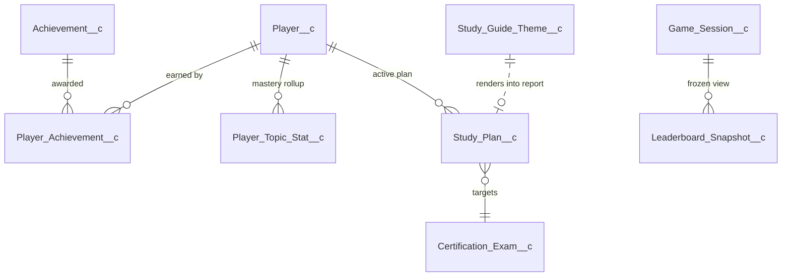

# :material-account-star-outline: Engagement & Insights

The "is the player getting better?" surface. Achievements gamify; `Player_Topic_Stat__c` and `Study_Plan__c` drive coaching; `Study_Guide_Theme__c` skins the readiness report; `Leaderboard_Snapshot__c` freezes rankings.

---

## :material-medal-outline: Achievement__c

**Purpose.** Definition of an achievable badge. The trigger condition (`Criteria_Type__c` + `Threshold__c`) is evaluated by `AchievementService` on every `QuestionAnswered__e` event.

| Field | Type | Set by | Purpose |
|-------|------|--------|---------|
| `Code__c` | Text(40) | :material-pencil-outline: editable | Stable identifier (e.g. `FIRST_100`). |
| `Description__c` | LongText | :material-pencil-outline: editable | Public copy shown when awarded. |
| `Icon_Emoji__c` | Text(10) | :material-pencil-outline: editable | Slack icon. |
| `Active__c` | Checkbox | :material-pencil-outline: editable | Pauses awards without deleting the row. |
| `Premium_Only__c` | Checkbox | :material-pencil-outline: editable | Pro/Enterprise-only badges. |
| `Criteria_Type__c` | Picklist | :material-pencil-outline: editable | `TotalAnswers` / `CorrectAnswers` / `TotalPoints`. |
| `Threshold__c` | Number | :material-pencil-outline: editable | Numeric goal. |
| `Points__c` | Number | :material-pencil-outline: editable | Bonus points granted on award. |

---

## :material-medal: Player_Achievement__c

**Purpose.** Awarded-badge instance — one row per (player, achievement). Idempotent by `Unique_Key__c` so re-running the awarder is safe.

| Field | Type | Set by | Purpose |
|-------|------|--------|---------|
| `Player__c` | Lookup | :material-cog-sync-outline: system | Recipient. |
| `Achievement__c` | Lookup | :material-cog-sync-outline: system | Which badge. |
| `Game_Session__c` | Lookup | :material-cog-sync-outline: system | Session that triggered the award (optional). |
| `Unique_Key__c` | Text(80) ext-id | :material-cog-sync-outline: system | `<playerId>:<achievementCode>`. |
| `Awarded_At__c` | DateTime | :material-cog-sync-outline: system | When granted. |

---

## :material-chart-bell-curve-cumulative: Player_Topic_Stat__c

**Purpose.** Per-player mastery rollup. One row per (player, topic-type, topic-value). The single source of truth for strengths/weaknesses, word clouds, and the recurring-misconception list.

**External ID.** `Topic_Key__c` = `<playerId>|<type>|<lower(value)>`. Upserts are idempotent.

| Field | Type | Set by | Purpose |
|-------|------|--------|---------|
| `Player__c` | Lookup | :material-cog-sync-outline: system | The player. |
| `Topic_Type__c` | Picklist | :material-cog-sync-outline: system | `Keyword` / `Tag` / `Entity` / `Domain` / `Difficulty` / `Misconception`. |
| `Topic_Value__c` | Text(255) | :material-cog-sync-outline: system | The term (`Role Hierarchy`, `sharing-rule-downgrade`, etc.). |
| `Topic_Key__c` | Text(200) ext-id | :material-cog-sync-outline: system | Composite upsert key. |
| `Times_Seen__c` | Number | :material-cog-sync-outline: system | Total encounters. |
| `Times_Correct__c` | Number | :material-cog-sync-outline: system | Correct answers featuring this topic. |
| `Times_Incorrect__c` | Number | :material-cog-sync-outline: system | Wrong answers featuring this topic. |
| `Last_Seen_At__c` | DateTime | :material-cog-sync-outline: system | For decay / relevance ranking. |
| `Accuracy_Pct__c` | Number | :material-calculator-variant-outline: formula | `IF(Times_Seen__c = 0, 0, Times_Correct__c / Times_Seen__c * 100)`. |

**Used by.** `CertGamePlayerInsightsService.recordAnswerInsights` (write fan-out from `Player_Answer__c`), `weakestTopics(playerId, minSeen, limitN)`, `wordCloud(playerId, topicType, limitN)`.

!!! example "What gets rolled up from a single answer"
    When a player answers a question with `Keywords__c = "sharing rules, profile permissions"`, `Tags__c = "security"`, and `Question_Domain__c = "Security & Access"`:

    - 2 `Keyword` rows upserted (one per keyword)
    - 1 `Tag` row upserted
    - 1 `Domain` row upserted
    - 1 `Difficulty` row upserted
    - If incorrect: 1 `Misconception` row upserted (from the picked choice's `Misconception_Tag__c`)

    Each row's `Times_Seen__c` increments by 1; `Times_Correct__c` or `Times_Incorrect__c` increments by 1.

---

## :material-calendar-clock-outline: Study_Plan__c

**Purpose.** Per-player goal + nudge cadence. The scheduler queries `Next_Nudge_At__c <= NOW()` to find players to ping.

| Field | Type | Set by | Purpose |
|-------|------|--------|---------|
| `Player__c` | Lookup | :material-pencil-outline: editable | Owner. |
| `Certification_Exam__c` | Lookup | :material-pencil-outline: editable | Target exam. |
| `Status__c` | Picklist | :material-pencil-outline: editable | `Active` / `Paused` / `Completed`. |
| `Active__c` | Checkbox | :material-pencil-outline: editable | Quick toggle independent of `Status__c`. |
| `Daily_Questions__c` | Number | :material-pencil-outline: editable | Target questions/day used by the nudge engine. |
| `Target_Exam_Date__c` | Date | :material-pencil-outline: editable | When the player plans to sit the real exam. Drives countdown copy. |
| `Next_Nudge_At__c` | DateTime | :material-cog-sync-outline: system | Computed by nudge scheduler from cadence + timezone. |
| `Weak_Domains_JSON__c` | LongText | :material-cog-sync-outline: system | Snapshot of weakest domains at last nudge generation. |

---

## :material-palette-outline: Study_Guide_Theme__c

**Purpose.** Skin for the rendered HTML study guide. Reviewers can pick a theme to A/B layouts without code changes.

| Field | Type | Set by | Purpose |
|-------|------|--------|---------|
| `Theme_Key__c` | Text(80) | :material-pencil-outline: editable | Stable identifier (e.g. `executive`, `playful`). |
| `Description__c` | LongText(1000) | :material-pencil-outline: editable | Internal description. |
| `Body__c` | LongText(131072) | :material-pencil-outline: editable | The HTML/CSS template body with `{{merge_fields}}`. |
| `Is_Default__c` | Checkbox | :material-pencil-outline: editable | The fallback theme when no key matches. |
| `Active__c` | Checkbox | :material-pencil-outline: editable | Hides inactive themes from the picker. |
| `Sort_Order__c` | Number | :material-pencil-outline: editable | UI ordering. |

!!! info "Themes are deterministic, not LLM-generated"
    The study guide renderer merges ~50 computed variables (accuracy, streak, domain stats, trend data, recommendations) into the theme body. **No LLM is invoked.** All recommendation copy is programmatic — see `CertGameReadinessReportService`.

---

## :material-camera-outline: Leaderboard_Snapshot__c

**Purpose.** Frozen leaderboard at a moment in time (typically posted to Slack at session end). Avoids re-querying live state for old messages.

| Field | Type | Set by | Purpose |
|-------|------|--------|---------|
| `Game_Session__c` | Lookup | :material-cog-sync-outline: system | The session this snapshot belongs to. |
| `Round_Number__c` | Number | :material-cog-sync-outline: system | Captured at this round (or final). |
| `Snapshot_JSON__c` | LongText | :material-cog-sync-outline: system | JSON array of `{playerId, displayName, points, rank}`. |
| `Posted_To_Slack__c` | Checkbox | :material-cog-sync-outline: system | True after `chat.postMessage` succeeds. |
| `Slack_Message_Ts__c` | Text(40) | :material-cog-sync-outline: system | Slack message timestamp; used to update the card later. |
