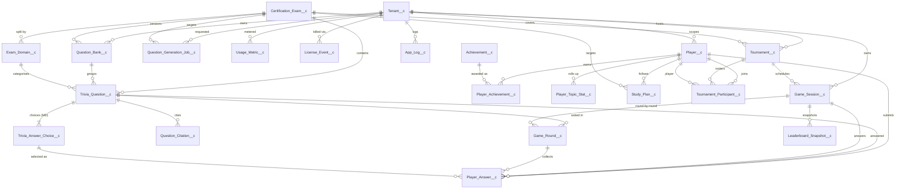
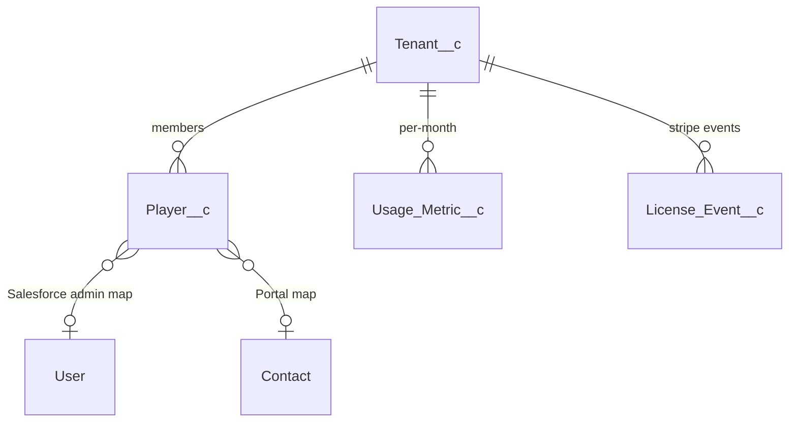
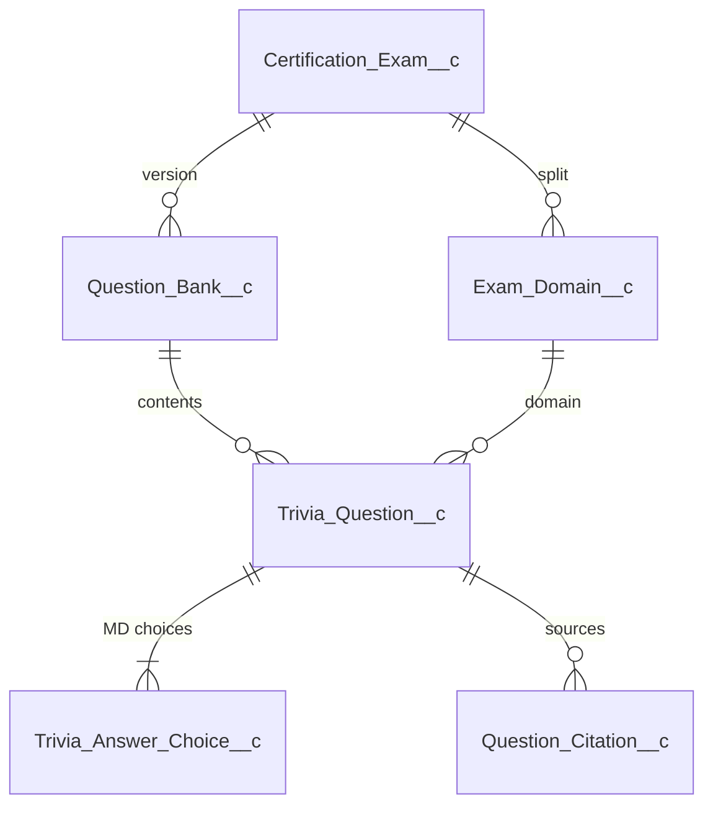
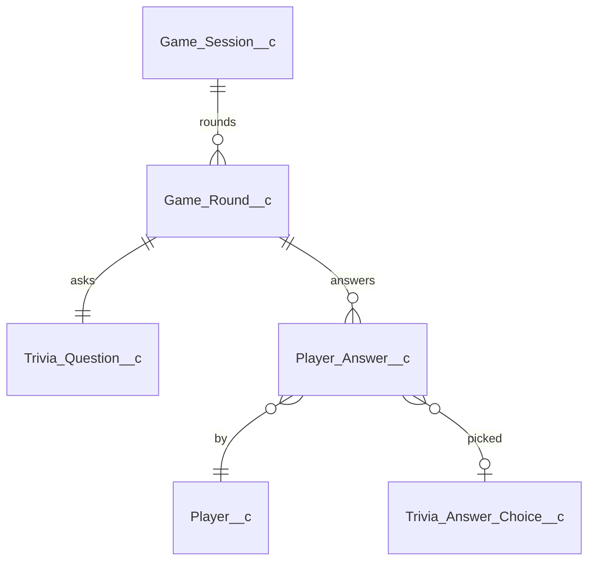
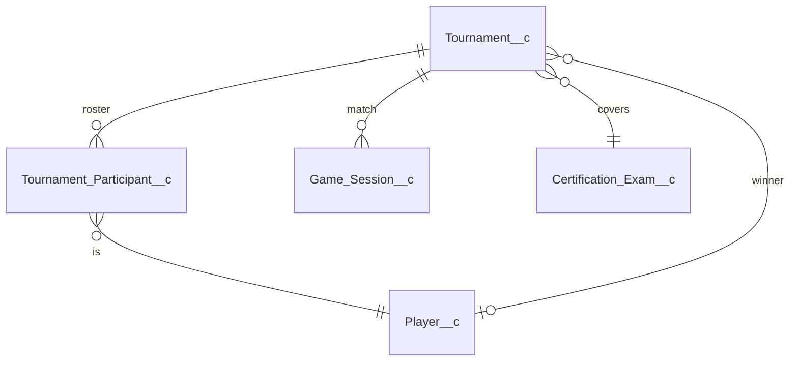
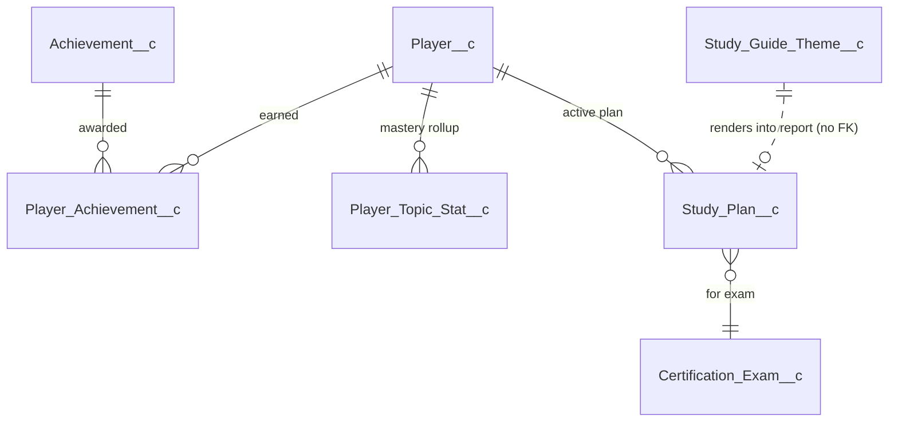
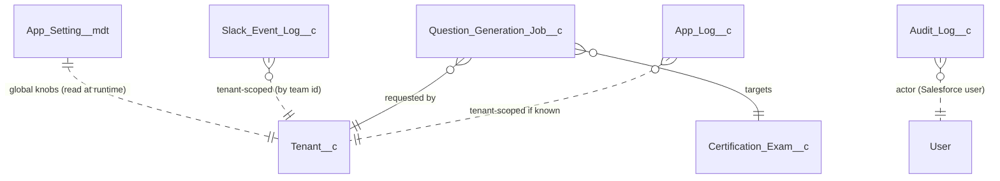

# :material-graph-outline: Entity Relationship Diagram

The full ERD across all 27 custom objects. If you're just orienting yourself, start with the **zoomed sub-diagrams** below; the full diagram is dense on purpose.

## Full ERD

## By business concept

### Tenancy & Identity

### Content

### Gameplay

### Tournaments

### Engagement & Insights

### Platform & Operations

!!! info "Why some lines are dotted"
    Dotted lines (`..`) are **logical** relationships not enforced by a lookup field — e.g. `Slack_Event_Log__c.Slack_Team_Id__c` is a text field that matches `Tenant__c.Slack_Team_Id__c` semantically, but there is no Salesforce relationship. This is intentional: idempotency logs and audit rows must survive tenant deletion.
