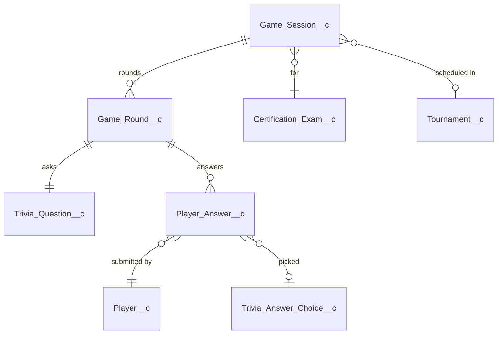

# :material-controller-classic: Gameplay

The hot path. Every Slack answer click traverses `Game_Session__c → Game_Round__c → Player_Answer__c` and then triggers scoring + insight rollups.

---

## :material-gamepad-variant-outline: Game_Session__c

**Purpose.** One run-through of N questions by a Player (Solo / Channel / Team Battle / Duel / Tournament). Holds session-level state — mode, status, timer, and (for duels) the join keys.

| Field | Type | Set by | Purpose |
|-------|------|--------|---------|
| `Tenant__c` | Lookup | :material-cog-sync-outline: system | Owning tenant. |
| `Certification_Exam__c` | Lookup | :material-pencil-outline: editable | Which exam this session draws from. |
| `Tournament__c` | Lookup | :material-cog-sync-outline: system | Set when session is part of a tournament match. |
| `Status__c` | Picklist | :material-cog-sync-outline: system | `Setup` → `Active` → `Paused`/`Completed`/`Abandoned`. |
| `Mode__c` | Picklist | :material-pencil-outline: editable | `Solo` / `Channel` / `Team Battle` / `Duel` / `Tournament` / etc. |
| `Started_At__c` | DateTime | :material-cog-sync-outline: system | First round posted. |
| `Completed_At__c` | DateTime | :material-cog-sync-outline: system | Last round finalized. |
| `Total_Questions__c` | Number | :material-cog-sync-outline: system | Length of the session. |
| `Current_Question_Index__c` | Number | :material-cog-sync-outline: system | Cursor for the next round to post (0-indexed). |
| `Timer_Seconds__c` | Number | :material-pencil-outline: editable | Per-question countdown. Defaults from `Certification_Exam__c.Default_Timer_Seconds__c`. |
| `Slack_Channel_Id__c` | Text(40) | :material-cog-sync-outline: system | Where to post rounds. |
| `Slack_Team_Id__c` | Text(40) | :material-cog-sync-outline: system | Denormalized for indexing. |
| `Started_By_Slack_User_Id__c` | Text(40) | :material-cog-sync-outline: system | Who ran `/certgame play`. |
| `Duel_Group_Id__c` | Text(64) | :material-cog-sync-outline: system | UUID linking the two `Game_Session__c` rows of a duel. |
| `Duel_Origin_Channel_Id__c` | Text(40) | :material-cog-sync-outline: system | Channel where the duel was initiated. |
| `Duel_Opponent_Slack_User_Id__c` | Text(40) | :material-cog-sync-outline: system | The other player. |
| `Duel_Role__c` | Picklist | :material-cog-sync-outline: system | `Challenger` / `Opponent`. |

**Used by.** `CertGameSessionService` (state machine), `CertGameDuelService` (pairing), `CertGameDuelFinalizer` (`@future(callout=true)` finale callout), `CertGameTournamentService` (scheduling).

!!! danger "Why duels need a `@future` finalizer"
    Apex forbids a callout after DML in the same transaction. The final-round answer upsert is DML; the duel finale `chat.postMessage` is a callout. `recordAnswerFromSlack` enqueues `CertGameDuelFinalizer` for the last answer. **Do not "simplify" by inlining the callout.**

---

## :material-numeric: Game_Round__c

**Purpose.** One presented question within a session. Links the question to a specific position in the play sequence.

| Field | Type | Set by | Purpose |
|-------|------|--------|---------|
| `Game_Session__c` | Lookup | :material-cog-sync-outline: system | Owning session. |
| `Trivia_Question__c` | Lookup | :material-cog-sync-outline: system | Which question was posted. |
| `Round_Number__c` | Number | :material-cog-sync-outline: system | 1-indexed position. |
| `Status__c` | Picklist | :material-cog-sync-outline: system | `Posted` / `Answered` / `Expired` / `Skipped`. |
| `Started_At__c` | DateTime | :material-cog-sync-outline: system | When the round was posted to Slack. |

**Used by.** `CertGameSessionService.postNextRound`, `CertGameScoringService`.

---

## :material-cursor-default-click-outline: Player_Answer__c

**Purpose.** The submitted answer. Once written, it's immutable for analytics. Heavily denormalized so historical reports stay correct after a question is edited or retired.

**External ID.** `Unique_Key__c` = `<roundId>:<playerId>` — prevents double-submits.

| Field | Type | Set by | Purpose |
|-------|------|--------|---------|
| `Unique_Key__c` | Text(80) ext-id | :material-cog-sync-outline: system | `<roundId>:<playerId>`. |
| `Game_Session__c` | Lookup | :material-cog-sync-outline: system | Owning session. |
| `Game_Round__c` | Lookup | :material-cog-sync-outline: system | Owning round. |
| `Player__c` | Lookup | :material-cog-sync-outline: system | Who answered. |
| `Trivia_Question__c` | Lookup | :material-cog-sync-outline: system | What they answered. |
| `Selected_Choice__c` | Lookup → Choice | :material-cog-sync-outline: system | Picked option (single-select). |
| `Selected_Choice_Labels__c` | Text(40) | :material-cog-sync-outline: system | `"A,C"` for multi-select. |
| `Selected_Choice_Text__c` | Text(255) | :material-cog-sync-outline: system | Snapshot of the picked text — survives edits to the choice. |
| `Is_Correct__c` | Checkbox | :material-cog-sync-outline: system | Scored at write time by `CertGameScoringService`. |
| `Points_Awarded__c` | Number | :material-cog-sync-outline: system | Computed from difficulty × time bonus. |
| `Response_Time_Ms__c` | Number | :material-cog-sync-outline: system | Slack click latency. |
| `Answered_At__c` | DateTime | :material-cog-sync-outline: system | Server receipt time. |
| `Explanation_Shown__c` | Checkbox | :material-cog-sync-outline: system | Did the player view the explanation card. |
| `Misconception_Tag__c` | Text(120) | :material-cog-sync-outline: system | Copied from the chosen wrong choice. Feeds `Player_Topic_Stat__c (Topic_Type__c = 'Misconception')`. |
| `Question_Domain__c` | Text(255) | :material-cog-sync-outline: system | **Snapshot** of `Exam_Domain__r.Name`. |
| `Question_Difficulty__c` | Text(40) | :material-cog-sync-outline: system | **Snapshot** of difficulty. |
| `Question_Keywords__c` | LongText(4000) | :material-cog-sync-outline: system | **Snapshot** of keywords. |
| `Question_Tags__c` | Text(255) | :material-cog-sync-outline: system | **Snapshot** of tags. |

**Used by.** `CertGameSessionService.recordAnswerFromSlack` (write), `CertGameScoringService` (write), `CertGamePlayerInsightsService` (fan-out to `Player_Topic_Stat__c`), `CertGameReadinessReportService` (read for the study guide).

!!! abstract "Why denormalize four fields?"
    Players can come back six months after a session and view their answer history. By then the question text, domain, or keywords may have changed. The snapshot fields make the historical record accurate against the question as it was — without them, every analytics number drifts every time a curator edits a question.
