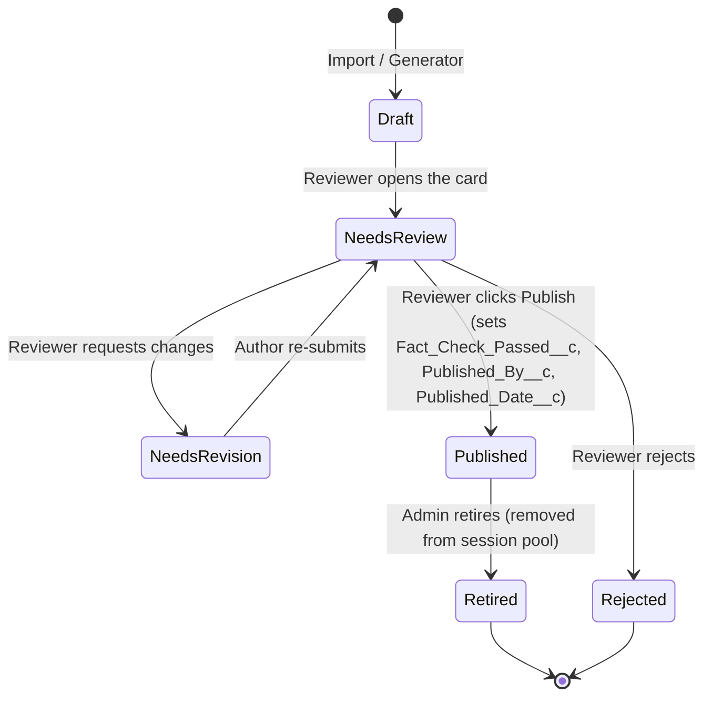
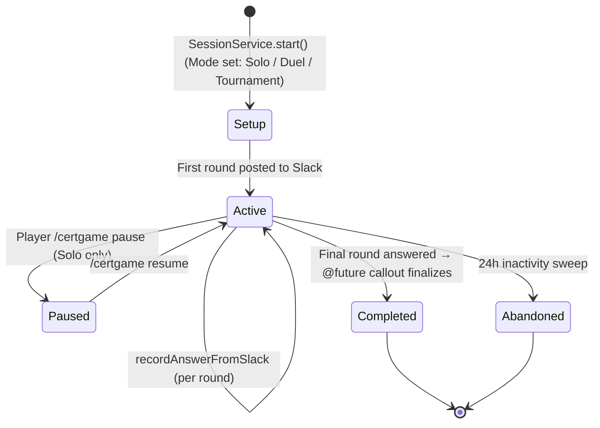
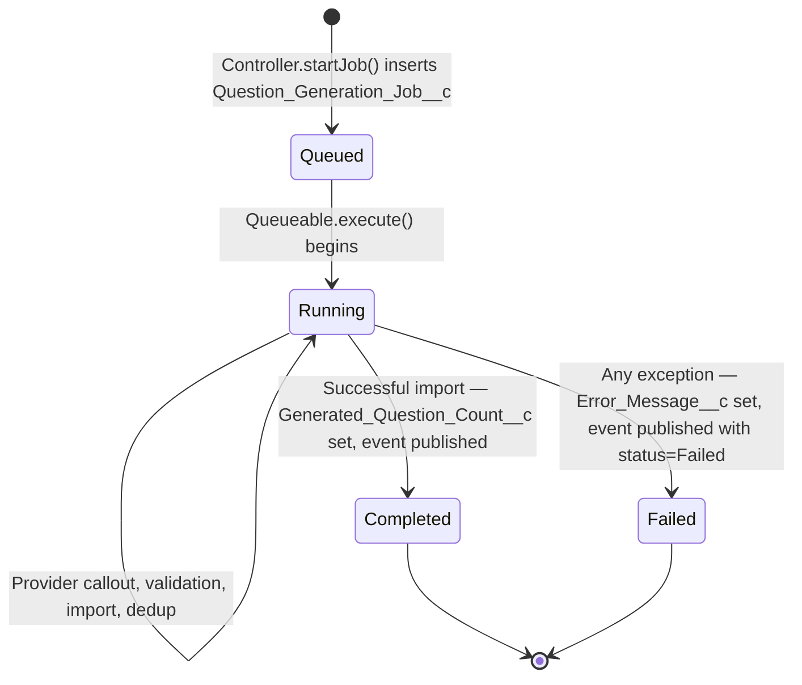

# :material-timeline-outline: Lifecycles

State machines for the three records that actually move through workflow states. Most other objects are append-only or last-write-wins; these three have real transitions you can break by writing to them out of order.

## Trivia Question lifecycle

Questions are born as drafts. **Code is never allowed to set `Status__c = Published`** — only the `questionReviewConsole` LWC, driven by a human reviewer, may.

!!! danger "Publish-gate invariants"
    `CertGameSessionService` selects only `Status__c = 'Published'` questions when building a session. If you bypass the review LWC and flip status programmatically, you've smuggled an un-fact-checked question into production play. The unit tests for `QuestionReviewController` exist to enforce this — don't suppress them.

## Game Session lifecycle

### Why the finale is a `@future(callout=true)`

The last round's answer DML and the Slack `chat.postMessage` for the finale card can't share a transaction (Apex forbids callouts after DML). `CertGameSessionService.recordAnswerFromSlack` enqueues `CertGameDuelFinalizer` (`@future(callout=true)`) for the last answer. Don't try to "fix" this by reordering.

## Generation Job lifecycle

The `QuestionGenerationJob__e` platform event fires on every transition so the `generationJobConsole` LWC can stream progress without polling.
