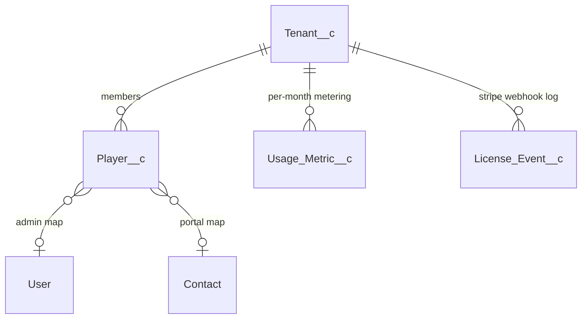

# :material-office-building-outline: Tenancy & Identity

The four objects that answer "who is this person and which workspace are they in?"

---

## :material-domain: Tenant__c

**Purpose.** One row per Slack workspace. Holds plan, Stripe IDs, install state. Every user-facing path resolves a `Tenant__c` first and re-checks `EntitlementGuard` against it.

**External ID.** `Slack_Team_Id__c` — populated on first Slack install (`SlackInstallService.getOrCreateTenant`).

| Field | Type | Set by | Purpose |
|-------|------|--------|---------|
| `Slack_Team_Id__c` | Text(40) ext-id | :material-cog-sync-outline: system | Slack `T…` id. The workspace's stable identifier. |
| `Workspace_Name__c` | Text(120) | :material-pencil-outline: editable | Display name from Slack `team.info` on install. |
| `Plan__c` | Picklist | :material-pencil-outline: editable | `Free` / `Pro` / `Enterprise`. Drives every quota in `EntitlementGuard`. |
| `Status__c` | Picklist | :material-pencil-outline: editable | `Trial` / `Active` / `PastDue` / `Cancelled` / `Suspended`. Set by Stripe webhook for billing-driven transitions. |
| `Seats_Purchased__c` | Number | :material-pencil-outline: editable | Seat cap (Pro/Enterprise). |
| `Trial_Ends_At__c` | DateTime | :material-pencil-outline: editable | When the trial expires; nightly job flips `Status__c → PastDue` if not converted. |
| `Installed_At__c` | DateTime | :material-cog-sync-outline: system | First-install timestamp. |
| `Stripe_Customer_Id__c` | Text(80) | :material-cog-sync-outline: system | Set when checkout completes. |
| `Stripe_Subscription_Id__c` | Text(80) | :material-cog-sync-outline: system | Set on subscription create; updated on plan change. |
| `Admin_Slack_User_Ids__c` | LongText | :material-pencil-outline: editable | Newline- or comma-separated Slack `U…` ids — who can run `/certgame admin …`. |

**Used by.** `SlackInstallService`, `EntitlementGuard`, `StripeWebhookHandler`, every Slack handler (for tenant resolution).

!!! warning "Don't soft-delete tenants"
    `Slack_Event_Log__c` and `License_Event__c` reference tenant only by Slack team id (text), not by lookup, so dropping a Tenant record won't clean them up. Mark `Status__c = Cancelled` instead.

---

## :material-account-circle-outline: Player__c

**Purpose.** One row per human, per workspace. Bridges three identities: Slack (`Slack_User_Id__c`), Google (`Google_Sub__c`), and optionally a real Salesforce `User`/`Contact`.

**Dual external IDs.** Both `Slack_User_Id__c` and `Google_Sub__c` are external-id upsert keys — the same person playing on Slack first and signing in to the web companion later is **merged** by `WebAuthService.linkSlackPlayer()`.

| Field | Type | Set by | Purpose |
|-------|------|--------|---------|
| `Display_Name__c` | Text(120) | :material-pencil-outline: editable | Shown on leaderboards. Defaults to Slack `real_name` or Google name. |
| `Slack_User_Id__c` | Text(40) ext-id | :material-cog-sync-outline: system | Slack `U…` id. |
| `Slack_Team_Id__c` | Text(40) | :material-cog-sync-outline: system | Denormalized for tenant scoping in queries. |
| `Tenant__c` | Lookup → Tenant | :material-cog-sync-outline: system | Owning workspace. |
| `Google_Sub__c` | Text(64) ext-id | :material-cog-sync-outline: system | Google OAuth `sub` claim — stable identifier. |
| `Google_Email__c` | Email | :material-cog-sync-outline: system | From OAuth `email` claim. |
| `Google_Name__c` | Text(120) | :material-cog-sync-outline: system | From OAuth `name`. |
| `Google_Picture_URL__c` | URL | :material-cog-sync-outline: system | Avatar. |
| `Web_Last_Login_At__c` | DateTime | :material-cog-sync-outline: system | Last successful Google sign-in. |
| `Salesforce_User__c` | Lookup → User | :material-pencil-outline: editable | Admin-curated mapping for internal users. |
| `Mapped_Contact__c` | Lookup → Contact | :material-pencil-outline: editable | Fallback mapping (portal/community). |
| `Timezone__c` | Text(64) | :material-pencil-outline: editable | IANA TZ. Read by the nudge scheduler. |
| `Total_Points__c` | Number | :material-cog-sync-outline: system | Lifetime points. Incremented by `CertGameScoringService`. |
| `Total_Games__c` | Number | :material-cog-sync-outline: system | Sessions completed. |
| `Accuracy__c` | Percent | :material-cog-sync-outline: system | Running accuracy. |
| `Current_Streak_Days__c` | Number | :material-cog-sync-outline: system | Days-in-a-row played. |
| `Longest_Streak_Days__c` | Number | :material-cog-sync-outline: system | Best streak ever. |
| `Last_Played_At__c` | DateTime | :material-cog-sync-outline: system | Most recent answer; used for streak break detection. |

**Used by.** Every gameplay path. `Player__c` is the foreign key on `Player_Answer__c`, `Player_Achievement__c`, `Player_Topic_Stat__c`, `Study_Plan__c`, `Tournament_Participant__c`.

---

## :material-counter: Usage_Metric__c

**Purpose.** Per-tenant, per-month meter. `EntitlementGuard` compares these counters to plan quotas before allowing a generation, game start, or seat add.

**External ID.** `Unique_Key__c` = `<tenantId>:<YYYY-MM>`.

| Field | Type | Set by | Purpose |
|-------|------|--------|---------|
| `Tenant__c` | Lookup → Tenant | :material-cog-sync-outline: system | Owning tenant. |
| `Period__c` | Text(7) | :material-cog-sync-outline: system | `YYYY-MM` of the metering period. |
| `Unique_Key__c` | Text(80) ext-id | :material-cog-sync-outline: system | `<tenantId>:<period>`. |
| `Games_Started__c` | Number | :material-cog-sync-outline: system | Incremented on session create. |
| `Questions_Served__c` | Number | :material-cog-sync-outline: system | Incremented per round posted. |
| `Active_Players__c` | Number | :material-cog-sync-outline: system | Distinct players who answered this month. |
| `LLM_Tokens_In__c` / `LLM_Tokens_Out__c` | Number | :material-cog-sync-outline: system | Provider response token counts. |
| `LLM_Cost_USD__c` | Currency | :material-cog-sync-outline: system | Estimated cost. |

**Used by.** `EntitlementGuard` (read), `CertGameGenerationJobQueueable` (write), `CertGameSessionService` (write).

---

## :material-credit-card-outline: License_Event__c

**Purpose.** Append-only log of every Stripe webhook event processed. The idempotency layer for billing.

**External ID.** `Stripe_Event_Id__c` — `evt_…` from the webhook envelope. Upserting against this is what makes Stripe's at-least-once delivery safe.

| Field | Type | Set by | Purpose |
|-------|------|--------|---------|
| `Tenant__c` | Lookup → Tenant | :material-cog-sync-outline: system | Tenant resolved from `customer` id. |
| `Stripe_Event_Id__c` | Text(120) ext-id | :material-cog-sync-outline: system | Stripe event id. |
| `Event_Type__c` | Picklist | :material-cog-sync-outline: system | `TrialStarted` / `Upgraded` / `Downgraded` / `Cancelled` / etc. |
| `Occurred_At__c` | DateTime | :material-cog-sync-outline: system | Stripe `created` timestamp. |
| `Payload_JSON__c` | LongText | :material-cog-sync-outline: system | Raw webhook body for forensic replay. |

**Used by.** `StripeWebhookHandler` (write), audit/reporting (read).
