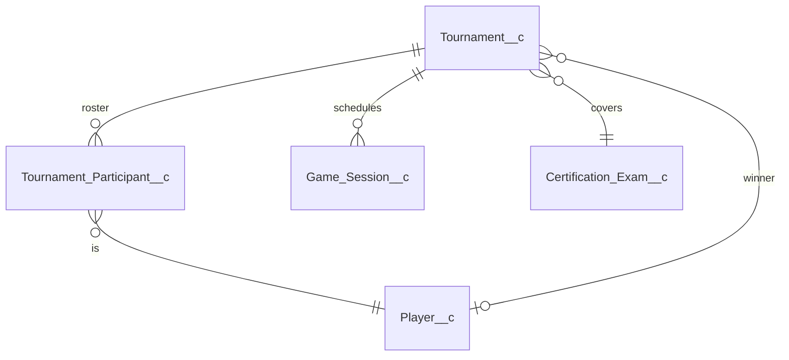

# :material-trophy-outline: Tournaments

Multi-session events. A tournament is a wrapper around many `Game_Session__c` rows linked through `Tournament_Participant__c` junctions.

---

## :material-tournament: Tournament__c

**Purpose.** Tournament definition: bracket, schedule, prize, and join policy. The runtime selects participants from `Tournament_Participant__c` and spawns one `Game_Session__c` per match.

| Field | Type | Set by | Purpose |
|-------|------|--------|---------|
| `Tenant__c` | Lookup | :material-cog-sync-outline: system | Owning tenant. |
| `Certification_Exam__c` | Lookup | :material-pencil-outline: editable | What exam is being tested. |
| `Slack_Team_Id__c` | Text(40) | :material-cog-sync-outline: system | Denormalized for indexing. |
| `Description__c` | LongText(4000) | :material-pencil-outline: editable | Marketing copy. |
| `Bracket_Type__c` | Picklist | :material-pencil-outline: editable | `RoundRobin` / `Elimination` / `OpenLadder`. |
| `Bracket_Json__c` | LongText | :material-cog-sync-outline: system | Computed bracket. Re-generated when participants change. |
| `Start_At__c` | DateTime | :material-pencil-outline: editable | Tournament opens. |
| `End_At__c` | DateTime | :material-pencil-outline: editable | Tournament closes. |
| `Completed_At__c` | DateTime | :material-cog-sync-outline: system | When bracket finished. |
| `Status__c` | Picklist | :material-cog-sync-outline: system | `Scheduled` / `Active` / `Complete` / `Cancelled`. |
| `Max_Participants__c` | Number | :material-pencil-outline: editable | Soft cap for registration. |
| `Questions_Per_Match__c` | Number | :material-pencil-outline: editable | Session length per match. |
| `Public_Join_Enabled__c` | Checkbox | :material-pencil-outline: editable | Allow non-tenant players via signed URL. |
| `Public_Join_Token__c` | Text(40) | :material-cog-sync-outline: system | Token embedded in the join URL. |
| `Prize_Description__c` | LongText | :material-pencil-outline: editable | Free-form prize copy. |
| `Sponsor_Logo_URL__c` | URL | :material-pencil-outline: editable | Sponsor branding for the bracket page. |
| `Winner_Player__c` | Lookup → Player | :material-cog-sync-outline: system | Set when bracket completes. |

---

## :material-account-multiple-outline: Tournament_Participant__c

**Purpose.** Junction between `Tournament__c` and `Player__c`. Holds the running tally per participant.

**External ID.** `Unique_Key__c` = `<tournamentId>:<playerId>`.

| Field | Type | Set by | Purpose |
|-------|------|--------|---------|
| `Tournament__c` | Lookup | :material-pencil-outline: editable | Parent tournament. |
| `Player__c` | Lookup | :material-pencil-outline: editable | Participant. |
| `Game_Session__c` | Lookup | :material-cog-sync-outline: system | Most-recent match session (legacy single-match link). |
| `Unique_Key__c` | Text(40) ext-id | :material-cog-sync-outline: system | `<tournamentId>:<playerId>`. |
| `Joined_At__c` | DateTime | :material-cog-sync-outline: system | Registration timestamp. |
| `Last_Played_At__c` | DateTime | :material-cog-sync-outline: system | Last match answered. |
| `Status__c` | Picklist | :material-cog-sync-outline: system | `Registered` / `Active` / `Completed` / `Eliminated` / `Forfeit` / `Withdrew`. |
| `Source__c` | Picklist | :material-pencil-outline: editable | `Public` / `Admin` / `Slack`. Tracks how the player got in. |
| `Questions_Answered__c` | Number | :material-cog-sync-outline: system | Running counter across matches. |
| `Questions_Correct__c` | Number | :material-cog-sync-outline: system | Running counter. |
| `Total_Points__c` | Number | :material-cog-sync-outline: system | Sum across matches. |
| `Rank__c` | Number | :material-cog-sync-outline: system | Computed by bracket service on each match completion. |
