# Deployment Procedures

Operational deploy + release runbook. For the Salesforce-specific commands and 2GP
packaging, see [Salesforce → Deployment](../salesforce/deployment.md).

## Environments

| Env                        | Purpose                                                   |
| -------------------------- | --------------------------------------------------------- |
| Scratch org (`certgame`)   | Local development.                                        |
| Sandbox                    | Pre-prod integration testing with a real Slack workspace. |
| Production / customer orgs | Released 2GP managed package.                             |

## Standard release flow

```mermaid
flowchart LR
    A[Branch off main] --> B[Local scratch deploy + tests]
    B --> C[Open PR]
    C --> D[CI: deploy + tests + scanner]
    D --> E[Review + merge to main]
    E --> F[Tag release v0.X.Y]
    F --> G[Package version create from Dev Hub]
    G --> H[Install in sandbox -> smoke test]
    H --> I[Promote package version]
    I --> J[Customer install]
```



## Local validation before PR

```bash
sf project deploy validate -o certgame --test-level RunLocalTests --wait 30
sf scanner run --target force-app --severity-threshold 2
```

## Slack app changes

If a deploy changes any of:

- Slack OAuth scopes
- Slash command name / subcommands
- Event subscriptions
- Request URLs

then the [slack-app-manifest.yaml](https://github.com/sfboss/slack_certification_salesforce_trivia/blob/main/slack-app-manifest.yaml)
**must** be updated in the same PR. Re-install the app in the dev workspace so the manifest
is applied before the Apex deploy lands.

## Secret rotation

Rotating any of the bound secrets:

1. Generate the new secret (Slack signing secret rotate, OpenAI key, Stripe restricted key).
2. **Setup → Security → Named Credentials → External Credentials** → open the credential
   → update the Principal.
3. For the Slack signing secret, also update
   `App_Setting__mdt.Default.Slack_Signing_Secret__c`.
4. Smoke test via `/certgame doctor`.

If you discover a secret has leaked to git history: rotate the secret immediately and
remove the offending blob from history per
[AGENTS.md §8](https://github.com/sfboss/slack_certification_salesforce_trivia/blob/main/AGENTS.md).

## Rollback

- Source deploy: re-deploy the previous git tag (`sf project deploy start -o ... -d <path>`).
- Package: have customers re-install the prior `04t...` version. 2GP managed packages do
  not support downgrade across major versions; plan migrations carefully.

## Phase gating

From [AGENTS.md §3](https://github.com/sfboss/slack_certification_salesforce_trivia/blob/main/AGENTS.md),
phases must meet their exit criteria before proceeding:

| Phase                      | Exit signal                                                  |
| -------------------------- | ------------------------------------------------------------ |
| 1 — Data model             | Sample JSON validates, perm set group assigned.              |
| 2 — Import + review        | Publishing flips status.                                     |
| 3 — Slack app shell        | `/certgame help` returns content; retries don't double-fire. |
| 4 — Single-game loop       | End-to-end Solo game completes.                              |
| 5 — App Home + nudges      | App Home shows stats; nudge fires.                           |
| 6 — Tournaments            | Brackets generate and play.                                  |
| 7 — Dynamic generation     | Queueable inserts drafts; live console works.                |
| 8 — Multi-tenant + billing | Stripe webhook updates `Tenant__c`.                          |
| 9 — Quality + audit        | Scanner High = 0; coverage targets met.                      |
| 10 — Package + list        | 2GP version published.                                       |
