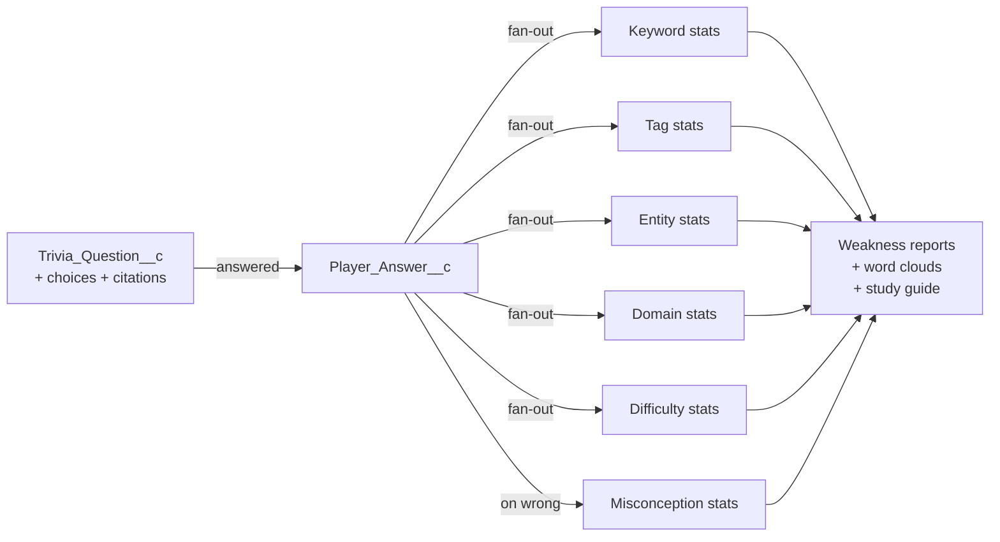

# :material-robot-outline: Question & Exam Generation

How question packs get into the database — by hand, by import, or by LLM — and how to maximise the metadata yield so every answer downstream produces useful analytics.

## Pages in this section

-   :material-pipe:{ .lg .middle } **[Generation Pipeline](pipeline.md)**

    ---

    The Queueable flow: provider → validator → importer → dedup → metering → platform event.

-   :material-message-text-outline:{ .lg .middle } **[Production Prompts](prompts.md)**

    ---

    Verbatim system prompts and JSON-schema strings currently sent to the LLM. Active providers vs stubs.

-   :material-file-tree-outline:{ .lg .middle } **[Recommended Prompt Templates](prompt-templates.md)**

    ---

    The richer prompt templates we *should* be sending — designed to populate every metadata field so weakness analytics light up.

-   :material-code-json:{ .lg .middle } **[Import Contract (JSON)](import-contract.md)**

    ---

    The exact JSON shape `CertGameImportService` consumes. Field-by-field rules, validation errors, and sample packs.

## Why metadata yield matters

Every answer a player submits writes a `Player_Answer__c` row and fans out into `Player_Topic_Stat__c` rows — one per keyword, tag, named entity, domain, difficulty, and (on wrong answers) misconception. The fan-out is driven entirely by what the question carries:

!!! abstract "The rule"
    A question with two-word `keywords` and no `misconceptionTag` on wrong choices produces near-empty analytics. A question with rich `keywords`, `tags`, `namedEntities`, `glossaryTerms`, and `misconceptionTag` on every wrong choice produces a per-player coaching surface that **earns its keep**.

The [Recommended Prompt Templates](prompt-templates.md) page exists specifically to push generators toward the rich end of that spectrum.

## Production status snapshot

| Provider | Status | Implementation |
|----------|--------|----------------|
| OpenAI (`gpt-4.1-mini` default) | :material-check-circle:{ .green } Active | `OpenAIQuestionProvider` |
| Gemini | :material-flask-outline: Stub | `GeminiQuestionProvider` throws `not yet implemented` |
| Claude | :material-flask-outline: Stub | `ClaudeQuestionProvider` throws `not yet implemented` |
| Mock | :material-test-tube: Test-only | Returns deterministic JSON for unit tests |

Selection is driven by `App_Setting__mdt.Default_Provider__c` and resolved by `QuestionGenerationProviderFactory`.
