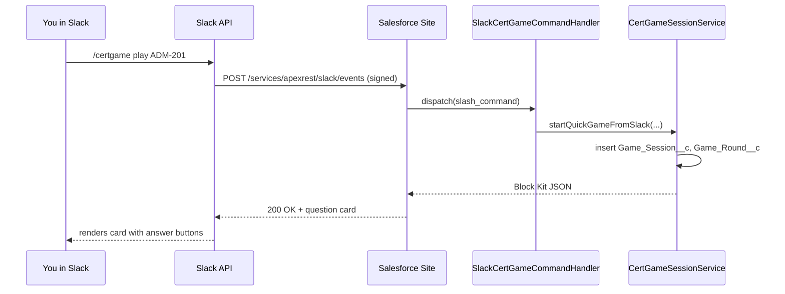

# Quick Start

Five-minute path assuming you've already completed [Installation](installation.md).

## 1. Import sample questions

In the Cert Game Manager Lightning app:

1. Navigate to **Question Bank**.
2. Click **Import**.
3. Paste the contents of
   [sample_data/adm201-question-pack.sample.json](https://github.com/sfboss/slack_certification_salesforce_trivia/blob/main/sample_data/adm201-question-pack.sample.json).
4. Click **Import**.

This creates a `Certification_Exam__c` (ADM-201), a `Question_Bank__c`, and a set of
`Trivia_Question__c` records — all in `Status__c = Draft`.

Or import via CLI:

```bash
python scripts/import_all_packs.py --org certgame
```

## 2. Publish a few drafts

1. Open the **Review Drafts** tab.
2. For three or four questions: review the stem, choices, citations → click **Publish**.

Drafts become `Status__c = Published` and the package treats them as playable.

!!! warning "Drafts never play live"
The import pipeline never creates `Status__c = Published`. Only a human action in the
review console flips a question into play. This is enforced by
[CertGameImportService](../api-reference/apex.md#certgameimportservice).

## 3. Verify with SOQL

In Developer Console or `sf data query`:

```sql
SELECT Certification_Exam__r.Certification_Code__c, COUNT(Id) published
FROM Trivia_Question__c
WHERE Status__c = 'Published'
GROUP BY Certification_Exam__r.Certification_Code__c
```

Expect at least one row.

## 4. Play in Slack

In any channel where the bot is present (or DM the bot):

```text
/certgame play ADM-201
```

You should get a question card. Tap a choice. The bot replies with explanation + citation
and either advances the round or finalizes the session.

## 5. Check your stats

```text
/certgame stats
```

This renders a Block Kit card sourced from `Player__c` rollups.

## 6. View the leaderboard

```text
/certgame leaderboard ADM-201
```

## What just happened



## Next steps

- Explore [the full feature set](../user-guide/features.md).
- Generate questions from an LLM: [Workflows → Generate questions](../user-guide/workflows.md#generate-questions).
- Set up a tournament: [Workflows → Create a tournament](../user-guide/workflows.md#create-a-tournament).
