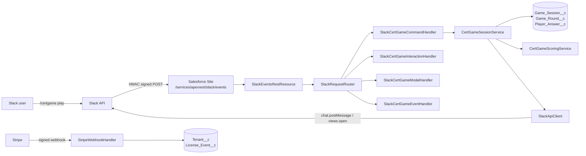

# Slack Certification Salesforce Trivia

:material-trophy-variant-outline: Salesforce-managed Slack app

<h1 class="ctt-hero__title">Turn cert prep into a multiplayer game — without leaving Slack.</h1>

A production-ready Salesforce-managed Slack application for certification trivia, study plans,
and tournaments. Every round, answer, achievement, and invoice is a Salesforce record. Slack is
just the surface.

[:material-rocket-launch: Quick start](getting-started/quick-start.md){ .primary }
[:material-database-outline: Data model](salesforce/data-model.md){ .ghost }
[:simple-github: View on GitHub](https://github.com/sfboss/slack_certification_salesforce_trivia){ .ghost }

  
<strong>27</strong>Custom objects

  
<strong>10</strong>Lightning Web Components

  
<strong>≥85%</strong>Apex coverage target

  
<strong>HMAC</strong>Verified webhooks

## Why this exists

- **Make certification prep social.** Players run `/certgame` in any channel or DM and play
  curated questions for ADM-201, PD-1, CRT-101, and more.
- **Keep Salesforce as the system of record.** Every game round, answer, achievement, and
  invoice is a Salesforce record.
- **Stay shippable.** The codebase is structured for the AppExchange Security Review:
  `with sharing` everywhere user input flows, HMAC verification on every webhook, idempotency
  keys on every external event, ≥85% Apex coverage with ≥95% on critical security classes.

---

## Architecture at a glance

---

## Quick links

- :material-rocket-launch: **[Quick Start](getting-started/quick-start.md)**

    5-minute path from clone to "first answered question."

- :simple-salesforce: **[Salesforce setup](salesforce/setup.md)**

    Scratch org, permission sets, Named Credentials.

- :simple-slack: **[Slack app setup](slack/setup.md)**

    Manifest install, scopes, signing secret.

- :material-database: **[Data model](salesforce/data-model.md)**

    All 27 custom objects and how they relate.

- :material-api: **[API reference](api-reference/index.md)**

    Every public Apex class, LWC, and REST endpoint.

- :material-shield-check: **[Security review notes](development/index.md)**

    HMAC verification, idempotency, FLS posture.

---

## What's in the box

| Surface | Owner | Where to look |
| --- | --- | --- |
| **Slack `/certgame` command** | Players | [Slash commands](slack/commands.md) |
| **Cert Game Manager Lightning app** | Admins | [User guide → features](user-guide/features.md) |
| **27 custom objects** | Salesforce | [Data model](salesforce/data-model.md) |
| **REST endpoints** | Slack & Stripe | [Salesforce APIs](salesforce/apis.md) |
| **10 Lightning Web Components** | Admins | [LWC reference](api-reference/lwc.md) |
| **Question generation pipeline** | Reviewers | [Workflows](user-guide/workflows.md) |
| **Stripe billing webhook** | Tenants | [API reference](api-reference/salesforce-api.md) |

---

## Source-of-truth files

- [README.md](https://github.com/sfboss/slack_certification_salesforce_trivia/blob/main/README.md) — short pointer.
- [AGENTS.md](https://github.com/sfboss/slack_certification_salesforce_trivia/blob/main/AGENTS.md) — phase-by-phase build plan, conventions, exit criteria.
- [slack-app-manifest.yaml](https://github.com/sfboss/slack_certification_salesforce_trivia/blob/main/slack-app-manifest.yaml) — Slack app manifest.
- [sfdx-project.json](https://github.com/sfboss/slack_certification_salesforce_trivia/blob/main/sfdx-project.json) — package definition.

All documentation pages here are derived from those files plus the deployed metadata. If you
spot a gap, log it in [Gaps & Follow-ups](_gaps.md).
