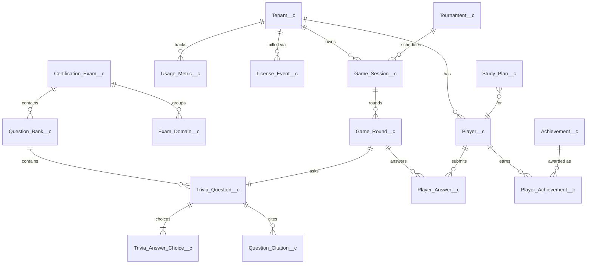

# Data Model

The package ships **27 custom objects** under
[force-app/main/default/objects](https://github.com/sfboss/slack_certification_salesforce_trivia/tree/main/force-app/main/default/objects).

## Core ERD (most-touched objects)

## Object catalog

All objects use the `__c` suffix and live under `force-app/main/default/objects/`.

### Content & curation

| Object                       | Role                                                                         |
| ---------------------------- | ---------------------------------------------------------------------------- |
| `Certification_Exam__c`      | A certification (ADM-201, PD-1, etc.). External id: `Certification_Code__c`. |
| `Exam_Domain__c`             | Topic grouping within an exam (e.g. "Security").                             |
| `Question_Bank__c`           | A versioned set of questions. External id: `External_Id__c`.                 |
| `Trivia_Question__c`         | The question stem, type, difficulty, status. Drafts never play live.         |
| `Trivia_Answer_Choice__c`    | Master-detail child of question. Holds choice text and `Is_Correct__c`.      |
| `Question_Citation__c`       | Source URL + relevance for a question.                                       |
| `Question_Generation_Job__c` | LLM generation job record (status, model, token usage).                      |

### Players & gameplay

| Object                    | Role                                                                                  |
| ------------------------- | ------------------------------------------------------------------------------------- |
| `Player__c`               | One row per Slack user per tenant. Holds rollups (accuracy, streak, lifetime points). |
| `Game_Session__c`         | A single match (Solo, Duel, Tournament).                                              |
| `Game_Round__c`           | One question presented in a session; carries `Slack_Message_Ts__c` for routing.       |
| `Player_Answer__c`        | A submitted answer. Unique key: `roundId:playerId`.                                   |
| `Achievement__c`          | Definition of an achievable badge.                                                    |
| `Player_Achievement__c`   | Awarded badge instance.                                                               |
| `Study_Plan__c`           | Player goals + nudge cadence.                                                         |
| `Leaderboard_Snapshot__c` | Frozen leaderboard at a moment in time.                                               |

### Tournaments

| Object          | Role                                                         |
| --------------- | ------------------------------------------------------------ |
| `Tournament__c` | Tournament definition. `Bracket_Json__c` stores the bracket. |

### Tenancy, billing, audit

| Object               | Role                                                                              |
| -------------------- | --------------------------------------------------------------------------------- |
| `Tenant__c`          | One Slack workspace. External id: `Slack_Team_Id__c`. Has `Plan__c`, `Status__c`. |
| `Usage_Metric__c`    | Per-tenant rolling counters (monthly period). Unique: `tenantId:YYYY-MM`.         |
| `License_Event__c`   | Stripe webhook record. Unique: `Stripe_Event_Id__c`.                              |
| `Slack_Event_Log__c` | Idempotency log for inbound Slack payloads. Unique: `Slack_Event_Id__c`.          |
| `Audit_Log__c`       | Tamper-evident audit trail.                                                       |
| `App_Log__c`         | Structured application/error log.                                                 |

### Custom metadata & platform events

| Type            | Object                     | Role                                                                               |
| --------------- | -------------------------- | ---------------------------------------------------------------------------------- |
| Custom Metadata | `App_Setting__mdt`         | Feature flags, quotas, model names. The `Default` record is read by `AppSettings`. |
| Platform Event  | `QuestionGenerationJob__e` | Live status updates streamed to `generationJobConsole` LWC.                        |
| Platform Event  | `QuestionAnswered__e`      | Fires on every answer; consumed by achievement service.                            |

## Key external IDs (idempotency keys)

| Object                  | External ID field                    | Used by                              |
| ----------------------- | ------------------------------------ | ------------------------------------ |
| `Certification_Exam__c` | `Certification_Code__c`              | Import upserts; Slack `play <CODE>`. |
| `Question_Bank__c`      | `External_Id__c`                     | Import upsert.                       |
| `Trivia_Question__c`    | `External_Id__c`                     | Import upsert.                       |
| `Tenant__c`             | `Slack_Team_Id__c`                   | `getOrCreateTenant`.                 |
| `Slack_Event_Log__c`    | `Slack_Event_Id__c`                  | Router idempotency.                  |
| `License_Event__c`      | `Stripe_Event_Id__c`                 | Stripe webhook idempotency.          |
| `Usage_Metric__c`       | `Unique_Key__c` (`tenantId:YYYY-MM`) | Entitlement counters.                |
| `Player_Answer__c`      | `Unique_Key__c` (`roundId:playerId`) | Prevents double answers.             |

## Field-level rules of note

- `Trivia_Question__c.Status__c` picklist: `Draft`, `Generated`, `Reviewed`, `Published`,
  `Retired`, `Rejected`. **Only `Published` is playable.**
- `Game_Session__c.Mode__c`: `Solo`, `Duel`, `Tournament`.
- `Game_Session__c.Status__c`: `Active`, `Completed`, `Abandoned`.
- `Trivia_Answer_Choice__c` is master-detail to `Trivia_Question__c` (cascades delete).
- `Trivia_Question__c.Hash__c` stores SHA-256 of normalized stem+correct-choice for
  duplicate detection ([`QuestionDuplicateDetector`](../api-reference/apex.md#questionduplicatedetector)).
