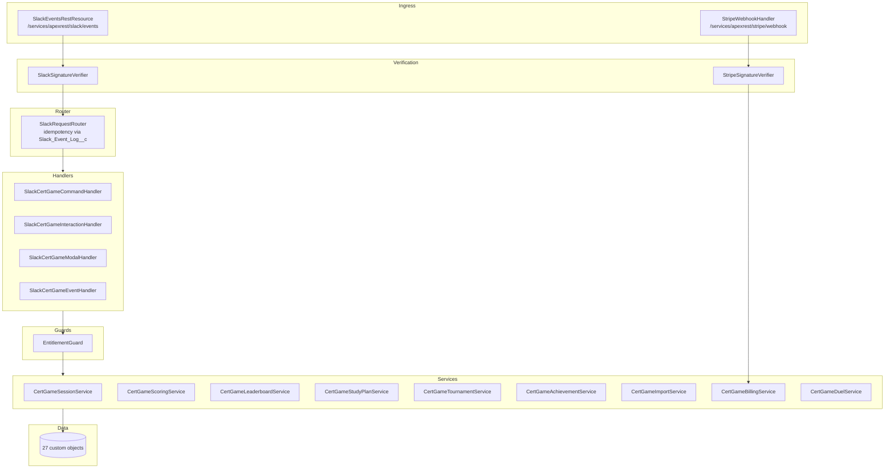

# Salesforce Integration Overview

## Purpose

Salesforce hosts **every persistent artifact** the application produces:

- Question banks, exams, and citations
- Players, sessions, rounds, and answers
- Achievements, leaderboards, study plans
- Tournaments and brackets
- Tenants (Slack workspaces), entitlements, usage metrics, license events
- Audit log and structured application logs

Slack only sends events in and receives Block Kit responses out. The Apex layer enforces
sharing, FLS, idempotency, and entitlement quotas before any data is written.

## High-level layers

## What lives where

| Surface | Files |
| --- | --- |
| **REST ingress** | [`SlackEventsRestResource`](../api-reference/apex.md#slackeventsrestresource), [`SlackRequestRouter`](../api-reference/apex.md#slackrequestrouter) |
| **Verifiers** | [`SlackSignatureVerifier`](../api-reference/apex.md#slacksignatureverifier), [`StripeSignatureVerifier`](../api-reference/apex.md#stripesignatureverifier) |
| **Handlers** | `SlackCertGame*Handler` classes |
| **Services** | `CertGame*Service` classes |
| **Render** | [`CertGameSlackRenderService`](../api-reference/apex.md#certgameslackrenderservice) — single owner of all Block Kit JSON |
| **Strings** | `CertGameStrings` — single owner of user-facing strings |
| **Guards** | [`EntitlementGuard`](../api-reference/apex.md#entitlementguard) — plan/quota checks |
| **Logging** | `AppLogger` (`App_Log__c`), `AuditLogger` (`Audit_Log__c`) |
| **Settings** | `App_Setting__mdt` (custom metadata) |

## Multi-tenancy

Every gameplay record points at a `Tenant__c` row, keyed by `Slack_Team_Id__c`. Tenants are
auto-created on first contact by
[`CertGameTenantService.getOrCreateTenant`](../api-reference/apex.md#certgametenantservice).

Plans (`Free`, `Pro`, `Enterprise`) live on `Tenant__c.Plan__c` and feed `EntitlementGuard`.

## Background jobs

| Job | Class | Cadence |
| --- | --- | --- |
| Citation auditor | `verify-citations.py` + scheduled Apex | Daily |
| Nudge dispatcher | `CertGameNudgeScheduler` | Hourly |
| Question generation | `CertGameGenerationJobQueueable` | On-demand (Queueable) |

## Read next

- [Data model](data-model.md) for object-by-object reference.
- [APIs](apis.md) for HTTP endpoints.
- [Setup](setup.md) to deploy.
