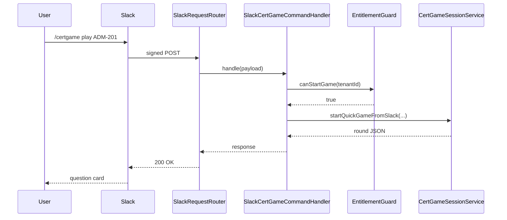

# Slash Commands

Every interaction with the bot starts with `/certgame <subcommand>`. The dispatch table is in
[`SlackCertGameCommandHandler`](../api-reference/apex.md#slackcertgamecommandhandler).

## Command reference

| Subcommand               | Args                        | Behavior                                                                  | Handler                                          |
| ------------------------ | --------------------------- | ------------------------------------------------------------------------- | ------------------------------------------------ |
| `help` _(default)_       | —                           | Render the help block.                                                    | `CertGameSlackRenderService.help`                |
| `play [CODE]`            | Certification code or blank | Start a Solo game; auto-picks an active exam if no code.                  | `CertGameSessionService.startQuickGameFromSlack` |
| `challenge @user [CODE]` | Mention + optional code     | Open a duel challenge card in the current channel. Alias: `duel`.         | `CertGameDuelService.openChallengeFromSlack`     |
| `games`                  | —                           | List configured exams.                                                    | `CertGameExamCatalogService.renderForSlack`      |
| `leaderboard [CODE]`     | Optional code               | Top players, optionally scoped to a cert.                                 | `CertGameLeaderboardService.renderLeaderboard`   |
| `stats`                  | —                           | Personal stats (accuracy, streak).                                        | `CertGameLeaderboardService.renderStats`         |
| `plan`                   | —                           | Open the Study Plan modal.                                                | `CertGameStudyPlanService.openPlanModal`         |
| `billing`                | —                           | Open the Billing modal (Pro/Enterprise admins).                           | `CertGameBillingService.openBillingModal`        |
| `debug`                  | —                           | Render the last hour of `App_Log__c` entries (for diagnostics).           | `SlackCertGameCommandHandler.renderDebug`        |
| `doctor`                 | —                           | Run the self-diagnostic suite (named credentials, custom metadata, etc.). | `CertGameDoctorService.run`                      |
| `notify-test`            | —                           | Post a sample notification card to confirm the outbound Slack pipeline.   | `CertGameNotificationTestService.run`            |

Anything else: returns `CertGameStrings.UNKNOWN_COMMAND` as an ephemeral message.

## Examples

### Help

```text
/certgame
/certgame help
```

### Play

```text
/certgame play
/certgame play ADM-201
/certgame play PD-1
```

`play <CODE>` matches `Certification_Exam__c.Certification_Code__c`. With no code,
[`CertGameSessionService.pickExam`](../api-reference/apex.md#certgamesessionservice)
picks the first active exam alphabetically.

### Challenge another player

```text
/certgame challenge @brendan ADM-201
/certgame duel @brendan
```

Channel-visible 1v1. The mentioned user is the only one who can click
**Accept** / **Decline**. On accept, both players get DMs and play 5 questions at their own
pace; the finale lands back in the originating channel with side-by-side scores and a
**Rematch** button.

Implementation: [`CertGameDuelService`](../api-reference/apex.md#certgameduelservice).

### Leaderboard

```text
/certgame leaderboard
/certgame leaderboard ADM-201
```

### Stats

```text
/certgame stats
```

### Open the study plan modal

```text
/certgame plan
```

Opens a modal where the player can pick exam, target date, and nudge cadence. Modal submit
flows through
[`SlackCertGameModalHandler`](../api-reference/apex.md#slackcertgamemodalhandler) →
[`CertGameStudyPlanService`](../api-reference/apex.md#certgamestudyplanservice).

### Open the billing modal

```text
/certgame billing
```

Available only when `Feature_Flag_Billing__c = true` and the calling user is in
`Tenant__c.Admin_Slack_User_Ids__c`. Generates a Stripe Customer Portal link via the
`Stripe` Named Credential.

## What runs after a slash command



## Notes for command authors

- **No DML before callouts.** Subcommands that open modals (`plan`, `billing`) make a
  Slack callout via `views.open`. Apex forbids callouts after DML in the same transaction,
  so `SlackCertGameCommandHandler.handle()` does **not** write audit logs inline — those are
  written by `SlackRequestRouter` after dispatch returns.
- **All user-facing strings** go through `CertGameStrings`.
- **All Block Kit JSON** is built in `CertGameSlackRenderService`.
