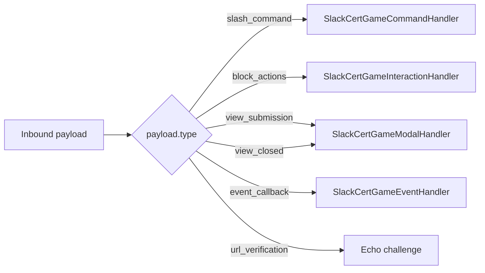

# Events

Slack event subscriptions handled by the package. Event routing is in
[`SlackRequestRouter`](../api-reference/apex.md#slackrequestrouter). Bot events handled by
[`SlackCertGameEventHandler`](../api-reference/apex.md#slackcertgameeventhandler).

## Subscribed bot events

From [slack-app-manifest.yaml](https://github.com/sfboss/slack_certification_salesforce_trivia/blob/main/slack-app-manifest.yaml):

| Event | Purpose | Handler effect |
| --- | --- | --- |
| `app_home_opened` | User opens the bot DM / Home tab. | Calls `CertGameAppHomeService` → `views.publish` with the player's stats. |
| `app_mention` | Bot is `@`-mentioned in a channel. | Currently logged for analytics. |

The setup guide additionally recommends subscribing to `app_uninstalled` and
`tokens_revoked` for production tenancy hygiene — see
[docs/slack-app-setup.md](https://github.com/sfboss/slack_certification_salesforce_trivia/blob/main/docs/slack-app-setup.md).

## URL verification

The very first POST Slack sends to any event subscription URL is a `url_verification`
payload. The router short-circuits this **before** signature verification:

```apex
if (rawBody != null && rawBody.contains('"url_verification"')) {
    // echo the challenge back unsigned
}
```

This lets you register a fresh endpoint before the signing secret is bound in
`App_Setting__mdt`.

## Payload dispatch table



`payload.type` is inferred by `SlackRequestRouter.inferType()` — it reads the type from
the parsed payload for JSON callbacks and from the presence of `command` / `payload` keys
for form-encoded bodies.

## Idempotency

Every dispatched payload is logged to `Slack_Event_Log__c`:

| Field | Source |
| --- | --- |
| `Slack_Event_Id__c` *(External Id)* | Slack `event.event_id`, or SHA-256 of the body if absent. |
| `Slack_Team_Id__c` | Inferred from payload. |
| `Event_Type__c` | `slash_command`, `block_actions`, etc. |
| `Payload_Hash__c` | SHA-256 of body. |
| `Received_At__c` | `System.now()` at dispatch time. |
| `Processed__c` | `true` once handler returns. |

A second arrival with the same `Slack_Event_Id__c` short-circuits with `200` and no
side effects. The insert happens **after** dispatch so handlers that make Slack callouts
(`views.open`) don't trip "uncommitted work pending".

## App Home publishing

When `app_home_opened` arrives, the handler:

1. Resolves `Tenant__c` from `team_id`.
2. Resolves `Player__c` from `user_id`.
3. Builds a Home view via `CertGameAppHomeService.buildHomeView(player)`.
4. Posts it with `views.publish`.

The Home view renders accuracy, streak, lifetime points, and quick buttons for `play`,
`leaderboard`, `plan`.
