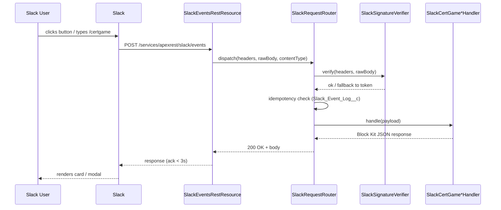

# Slack Bot Overview

The Slack app is a thin controller. Every gameplay surface in Slack is rendered from
Salesforce data through Block Kit JSON produced by
[`CertGameSlackRenderService`](../api-reference/apex.md#certgameslackrenderservice).

## Surfaces

| Surface                                        | Triggered by                | Rendered by                                     |
| ---------------------------------------------- | --------------------------- | ----------------------------------------------- |
| **Slash command response**                     | `/certgame ...`             | `SlackCertGameCommandHandler` → render service. |
| **Question card**                              | `play` + each round         | `CertGameSessionService.renderRound`.           |
| **Explanation card**                           | After answer                | `CertGameSessionService.recordAnswerFromSlack`. |
| **Finale card**                                | Last round of a session     | `CertGameSessionService.finalize`.              |
| **Duel cards** (Challenge / Accepted / Finale) | `/certgame challenge @user` | `CertGameDuelService`.                          |
| **Study plan modal**                           | `/certgame plan`            | `CertGameStudyPlanService.openPlanModal`.       |
| **Billing modal**                              | `/certgame billing`         | `CertGameBillingService.openBillingModal`.      |
| **App Home tab**                               | `app_home_opened` event     | `CertGameAppHomeService` → `views.publish`.     |
| **Nudge DMs**                                  | `CertGameNudgeScheduler`    | Render service → `chat.postMessage`.            |

## Outbound calls

All outbound HTTP goes through Named Credential `Slack_Bot` via
[`SlackApiClient`](../api-reference/apex.md#slackapiclient). Methods used:

- `chat.postMessage`
- `chat.postEphemeral`
- `views.open` (modals)
- `views.publish` (App Home)
- `users.info` (player display name enrichment)

## Inbound flow

## Manifest

The single source of truth for the Slack app definition is
[slack-app-manifest.yaml](https://github.com/sfboss/slack_certification_salesforce_trivia/blob/main/slack-app-manifest.yaml).
Three URLs all point at the same endpoint:

- Slash command request URL
- Interactivity request URL
- Event subscription request URL

Using the same URL is intentional — the Apex router infers the payload type and dispatches
to the correct handler.

## Action ID convention

All interactive component `action_id` values follow `domain:verb:resourceId`. Examples
observed in [`CertGameSlackRenderService`](../api-reference/apex.md#certgameslackrenderservice):

| `action_id`              | Owner                                              |
| ------------------------ | -------------------------------------------------- |
| `game:answer:<choiceId>` | Question card → `SlackCertGameInteractionHandler`. |
| `game:stop:<sessionId>`  | Question card.                                     |
| `duel:accept:<groupId>`  | Duel challenge card.                               |
| `duel:decline:<groupId>` | Duel challenge card.                               |
| `duel:rematch:<groupId>` | Duel finale card.                                  |
| `plan:save`              | Study plan modal submit.                           |
| `billing:upgrade:<plan>` | Billing modal.                                     |

This naming is enforced by convention — see
[AGENTS.md §4 Slack rendering](https://github.com/sfboss/slack_certification_salesforce_trivia/blob/main/AGENTS.md).
